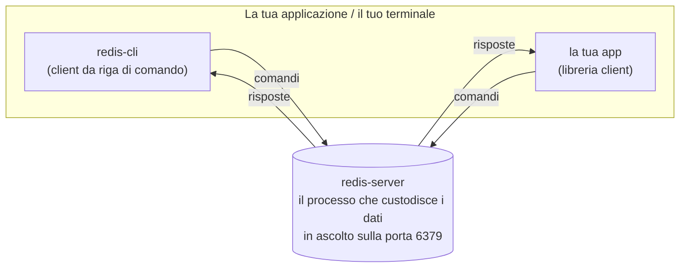
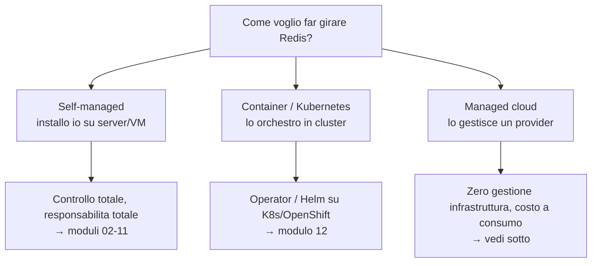

Questo modulo è il punto di partenza **se non hai mai usato Redis**. Spiega i
concetti e i termini che gli altri moduli danno per acquisiti. Se sei già
pratico, puoi saltare al [modulo 01](01-architettura.md).

## Cos'è Redis, in parole semplici

Redis è un **database in memoria** di tipo **chiave-valore**: tieni i dati nella
RAM (non sul disco), quindi le letture e le scritture sono **velocissime**
(microsecondi). Funziona come un grande "dizionario" condiviso in rete: a ogni
**chiave** (una stringa, es. `utente:42`) associ un **valore** (un testo, un
numero, una lista, ecc.).

Lo si usa tipicamente per:

- **Cache**: tenere a portata di mano dati costosi da ricalcolare o da leggere da
  un database più lento.
- **Sessioni utente**: chi è loggato, carrello, preferenze.
- **Contatori e classifiche**: like, visualizzazioni, leaderboard in tempo reale.
- **Code e messaggi**: passare lavoro tra servizi.

> Il prezzo della velocità: i dati stanno in RAM, che è limitata e volatile. Per
> questo esistono **persistenza** (salvare su disco per non perdere tutto a un
> riavvio, modulo 04) e **replica/HA** (avere copie pronte, moduli 05–06).

## Modello client-server

Redis è composto da due parti:



- **`redis-server`** è il programma che tiene i dati e risponde alle richieste.
  Gira come **servizio** (un processo sempre attivo, detto anche *demone*), in
  ascolto su una **porta** di rete (di default la **6379**).
- **`redis-cli`** è il client da terminale per parlare col server: lo userai in
  tutti i lab.
- La tua applicazione usa una **libreria client** (per Python, Java, Go, ecc.) che
  parla lo stesso "linguaggio" di rete.

Il tuo primo dialogo con Redis assomiglia a questo (`127.0.0.1` = la macchina
locale, *localhost*):

```bash
redis-cli -h 127.0.0.1 -p 6379
```

```text
127.0.0.1:6379> SET saluto "ciao"
OK
127.0.0.1:6379> GET saluto
"ciao"
127.0.0.1:6379> TTL saluto
(integer) -1        # -1 = nessuna scadenza impostata
```

`SET` scrive, `GET` legge: tutto qui per iniziare. I comandi sono parole
maiuscole per convenzione (Redis non distingue, ma aiuta a leggerli).

## Cosa ti serve per seguire il corso

- Un **terminale** su Linux o macOS (su Windows va benissimo WSL2).
- La capacità di lanciare comandi shell di base (`cd`, `ls`, copiare-incollare).
- Per i **laboratori**: un'istanza Redis installata in locale o su una VM. La
  prima installazione è il [modulo 02](02-installazione-standalone.md); i lab del
  [modulo 09](09-lab.md) girano su una singola macchina (anche il tuo portatile).

Non servono conoscenze pregresse di database o di programmazione: bastano
curiosità e un terminale.

## Le strade per usare Redis (panoramica)

Prima di installare, è utile sapere che Redis si può usare in **tre modi**. Questo
corso si concentra sul primo (self-managed), ma è bene conoscere le alternative.



| Modalità | Chi gestisce cosa | Quando ha senso |
|---|---|---|
| **Self-managed** (questo corso) | Gestisci tu OS, install, HA, backup, patch | Massimo controllo; on-prem, banking, requisiti specifici |
| **Container/Kubernetes** | Tu, ma con automazione (Operator) | Hai già una piattaforma K8s/OpenShift (modulo 12) |
| **Managed cloud** | Il provider gestisce infra, patch, HA | Vuoi velocità e poche operations, accetti il costo gestito |

### Opzioni managed (cenno)

Se non vuoi gestire l'infrastruttura, esistono servizi gestiti che ti danno un
endpoint Redis "pronto all'uso":

- **Redis Cloud** — il servizio gestito ufficiale di Redis, multi-cloud, con
  funzionalità enterprise (scaling, HA, Active-Active geo-distribuito).
- **Amazon ElastiCache** (Redis OSS / Valkey) e **Amazon MemoryDB** (variante con
  durabilità "primaria").
- **Azure Managed Redis** / **Azure Cache for Redis** (Microsoft).
- **Google Cloud Memorystore** (per Redis/Valkey/Cluster).

I concetti di questo corso (chiavi, TTL, persistenza, replica, cluster, eviction,
monitoring) restano **validi e utili anche sul managed**: cambia solo *chi*
preme i bottoni operativi. Conoscere il "sotto il cofano" ti rende un utente
migliore anche di un servizio gestito.

> **Redis o Valkey?** Nel 2024 Redis ha cambiato licenza e la community ha creato
> **Valkey**, un fork open source (BSD) sotto la Linux Foundation. Sono in larga
> parte compatibili: i comandi e i concetti del corso valgono per entrambi. Il
> dettaglio su versioni e licenze è nel [modulo 02](02-installazione-standalone.md).

## Glossario essenziale

I termini che incontrerai spesso (versione minima; gli approfondimenti sono nei
moduli indicati):

- **Istanza**: un singolo processo `redis-server` in esecuzione.
- **Chiave / valore**: l'unità di dato (`SET chiave valore`).
- **TTL**: *time to live*, scadenza di una chiave dopo cui viene cancellata.
- **Persistenza**: salvare i dati su disco — **RDB** (snapshot) e **AOF** (log
  delle scritture). Modulo 04.
- **Eviction**: cosa fa Redis quando finisce la memoria (cancella chiavi secondo
  una policy). Modulo 07.
- **Master / replica**: l'istanza scrivibile e le sue copie in sola lettura.
  Modulo 05.
- **Failover**: la promozione automatica di una replica a master se il master
  cade. Moduli 05–06.
- **Sentinel**: il sistema che sorveglia e automatizza il failover di un master.
  Modulo 05.
- **Cluster**: più master che si spartiscono i dati per scalare oltre un nodo.
  Modulo 06.
- **Shard / slot**: la "fetta" di dati gestita da un nodo del cluster (16384 slot
  totali). Modulo 06.
- **ACL**: regole su chi può fare cosa (utenti e permessi). Modulo 03.
- **`maxmemory`**: il tetto di RAM oltre cui Redis evince o rifiuta scritture.

## Come muoversi nel corso

- **Parti da zero?** Procedi in ordine: 00 → 01 (architettura) → 02 (installi e
  provi) → 03 (sicurezza di base) → 04 (persistenza), poi i lab del modulo 09 man
  mano.
- **Hai già esperienza?** Vai diretto ai moduli che ti servono; ogni lab del
  modulo 09 richiama il modulo teorico corrispondente.
- **Ti interessa Kubernetes/OpenShift?** Dopo aver capito i fondamenti (01) e l'HA
  (05–06), vedi il [modulo 12](12-kubernetes-openshift.md).

---

### Prossimo passo

[01 — Architettura e fondamenti](01-architettura.md): cosa succede "dentro"
Redis e perché è così veloce.
