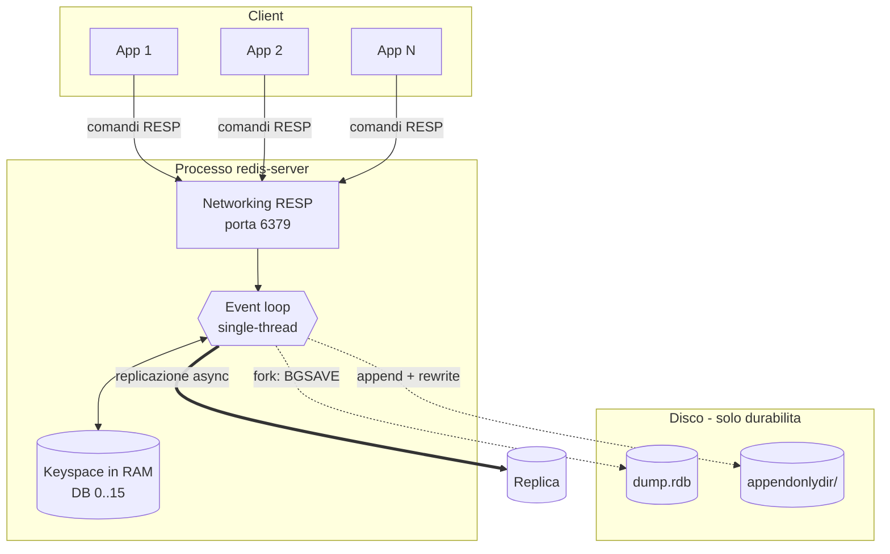
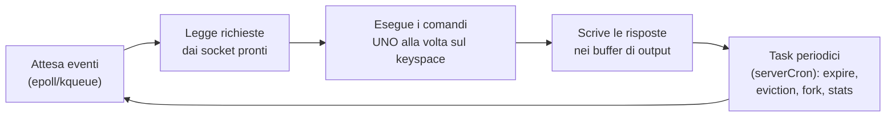
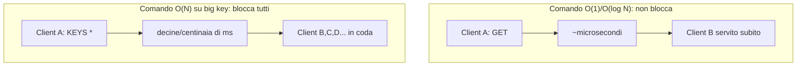
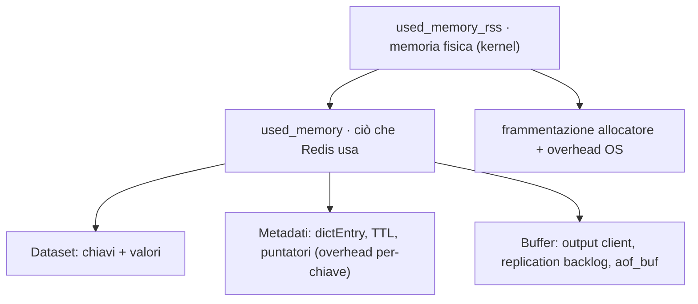
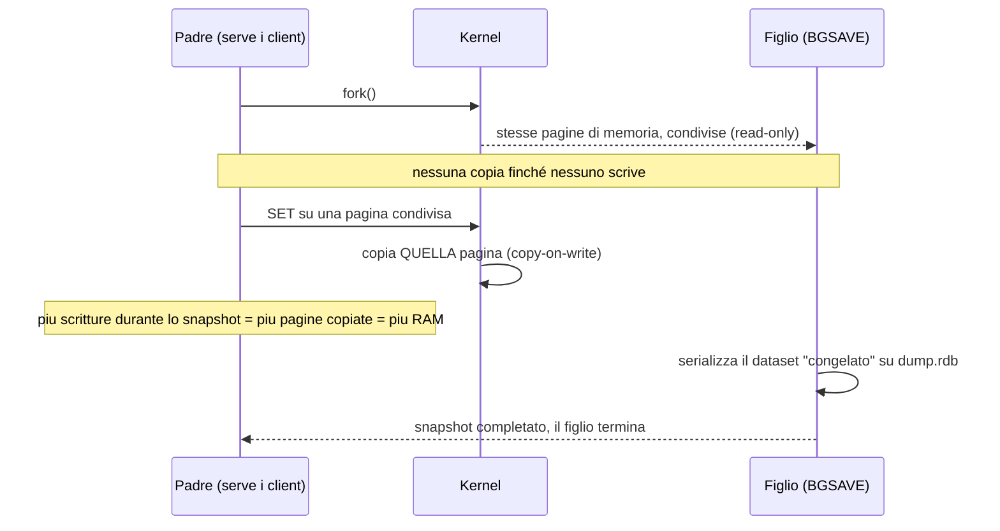

Obiettivo: capire *come* Redis usa CPU, memoria e disco, perché questo determina
ogni scelta operativa successiva (sizing, persistenza, latenza, eviction).

> **Parti da zero?** Se termini come *cache*, *chiave-valore*, *demone* o *porta*
> non ti sono familiari, leggi prima il [modulo 00](00-introduzione.md): spiega le
> basi e il glossario su cui questo modulo si appoggia.

---

## 1.1 Cos'è Redis, dal punto di vista ops

Redis è un **data store in-memory** key/value che tiene l'intero dataset in RAM e
usa il disco solo per durabilità (persistenza) e replica. Da qui derivano le sue
caratteristiche operative:

- **Latenza sub-millisecondo** perché non tocca il disco nel percorso di lettura.
- **La RAM è il vincolo primario**: il dataset deve stare in memoria, punto.
- **Durabilità configurabile**: puoi andare da "zero persistenza" (cache pura) a
  "fsync a ogni scrittura" (quasi-durabile), con tutto in mezzo.

Casi d'uso che incontri in produzione: cache applicativa, session store, rate
limiting, leaderboard/contatori, code di lavoro (List/Stream), pub/sub, lock
distribuiti, feature flag. Operativamente cambia molto se Redis è una **cache
sacrificabile** (può perdere dati, basta che sia veloce) o un **datastore
primario** (deve essere durabile e in HA): questa distinzione guida persistenza,
replica e backup.

Vista d'insieme di un'istanza:



Tutto ciò che conta in produzione gira intorno a tre risorse: la **RAM** (dove
vivono i dati), la **CPU** (un core fa girare l'event loop) e il **disco** (usato
solo fuori dal percorso critico, per persistenza e replica). I moduli successivi
sono, in fondo, la gestione di queste tre risorse.

---

## 1.2 Modello di esecuzione: single-thread (con sfumature)

Il cuore di Redis — l'esecuzione dei comandi sul keyspace — è **single-thread**:
un solo thread processa i comandi uno alla volta, in un event loop. Implicazioni
operative fondamentali:

- **Ogni comando è atomico** rispetto agli altri: niente race condition sul
  singolo comando, niente lock applicativi.
- **Un comando lento blocca tutti gli altri.** `KEYS *` su milioni di chiavi,
  `SMEMBERS` su un set enorme, uno script Lua pesante: bloccano l'intera istanza.
  Questo è il problema di latenza più comune in produzione. Usa varianti
  incrementali (`SCAN`, `HSCAN`, `SSCAN`, `ZSCAN`) invece dei comandi "tutto in
  una volta".
- **Un core potente conta più di molti core.** Redis non scala "in verticale"
  sui core per il throughput dei comandi; per usare più core si scala in
  orizzontale (più istanze / Redis Cluster) o si sfruttano gli I/O thread.

Le sfumature: dalla 6.0 esistono **I/O threads** che parallelizzano solo
lettura/scrittura dei socket (non l'esecuzione dei comandi), utili a throughput
elevati. Operazioni di fork (BGSAVE, rewrite AOF) e alcuni task vengono gestiti
da processi figli o thread di background, quindi "single-thread" si riferisce al
*command processing*, non all'intero processo.

Il ciclo, semplificato:



Il punto operativo da interiorizzare: la riga "esegue i comandi uno alla volta" è
un **collo di bottiglia serializzato**. Qualunque comando che impieghi, diciamo,
50 ms, aggiunge 50 ms di coda a *tutti* i client in attesa. Per questo in
produzione si bandiscono i comandi O(N) su strutture grandi e si preferiscono le
varianti `SCAN` a cursore, che spezzano il lavoro in micro-iterazioni e lasciano
respirare l'event loop.



---

## 1.3 Strutture dati (vista operativa)

Non serve conoscerle da sviluppatore, ma sapere che esistono aiuta a leggere
l'uso di memoria e i big key. Le principali:

- **String**: valore singolo (anche binario, fino a 512 MB). Cache, contatori.
- **Hash**: mappa campo→valore. Oggetti, sessioni.
- **List**: lista ordinata. Code (`LPUSH`/`RPOP`).
- **Set / Sorted Set (ZSet)**: insiemi, con o senza punteggio. Tag, leaderboard.
- **Stream**: log append-only con consumer group. Event sourcing, code robuste.
- **Bitmap / HyperLogLog / Geo**: contatori probabilistici e geospaziali.

Da Redis 8 sono integrate nel core anche strutture prima distribuite come moduli
separati (Search, JSON, Time Series, strutture probabilistiche, Vector set): è il
passaggio da "Redis Stack + moduli" a un'unica distribuzione **Redis Open
Source**. Operativamente significa un solo pacchetto da gestire.

### Encoding interni: perché la memoria non è "la somma dei valori"

Ogni tipo logico ha **encoding** diversi a seconda della dimensione, e l'encoding
determina quanta RAM consuma davvero. Redis usa una rappresentazione **compatta**
per le collezioni piccole e passa a una rappresentazione "piena" quando superano
certe soglie configurabili:

| Tipo | Encoding compatto (piccolo) | Encoding pieno (grande) | Soglia (config) |
|---|---|---|---|
| Hash | `listpack` | `hashtable` | `hash-max-listpack-entries/-value` |
| List | `listpack` → `quicklist` | `quicklist` | `list-max-listpack-size` |
| Set | `intset` / `listpack` | `hashtable` | `set-max-intset-entries`, `set-max-listpack-entries` |
| Sorted Set | `listpack` | `skiplist` | `zset-max-listpack-entries/-value` |

Implicazione operativa: tante collezioni **piccole** in encoding compatto costano
pochissimo; appena superano la soglia "esplodono" in hashtable/skiplist con molto
overhead per elemento. Verifica l'encoding reale di una chiave con:

```bash
redis-cli OBJECT ENCODING <chiave>
```

> Anti-pattern classico: usare milioni di chiavi top-level minuscole invece di
> raggrupparle in pochi hash. Pochi hash in `listpack` occupano una frazione
> della RAM rispetto a milioni di string con il loro overhead per-chiave.

Concetto chiave per ops: i **big key** (una chiave con milioni di elementi o da
centinaia di MB) sono la causa numero uno di latenza e di problemi di replica.
Imparerai a individuarli con `redis-cli --bigkeys` (modulo 07).

---

## 1.4 Modello di memoria

È la parte che devi padroneggiare di più. Redis distingue diverse metriche:

- **`used_memory`**: memoria che Redis ritiene di usare per i dati + overhead
  interno (allocata via allocatore, di default **jemalloc**).
- **`used_memory_rss`** (RSS): memoria fisica realmente occupata dal processo
  vista dal kernel.
- **`mem_fragmentation_ratio`** = RSS / used_memory. Sopra ~1.5 indica
  frammentazione significativa; sotto 1.0 significa che Redis è in **swap**
  (grave: la swap distrugge la latenza).

Cosa c'è dentro `used_memory`:



Lettura del rapporto, in pratica:

| `mem_fragmentation_ratio` | Significato | Azione |
|---|---|---|
| ~1.0 – 1.5 | Sano | Nessuna |
| > 1.5 stabile | Frammentazione | `activedefrag yes` (modulo 07) |
| < 1.0 | Parte della memoria è in **swap** | Emergenza: RAM/`swappiness`, `maxmemory` |

Altri concetti che tornano spesso:

- **Overhead**: ogni chiave ha un costo fisso (struttura, eventuale TTL, puntatori).
  Milioni di chiavi piccole costano molto più del totale dei loro valori.
- **Copy-on-write (COW)**: durante BGSAVE/rewrite AOF, Redis fa `fork()`. Il
  figlio condivide le pagine col padre finché non vengono modificate; più scrivi
  durante lo snapshot, più memoria extra serve. Pianifica RAM con margine
  (regola pratica: tieni almeno il 30–50% di RAM libera oltre al dataset).
- **`maxmemory` + eviction**: il limite oltre cui Redis evince o rifiuta
  scritture, secondo la `maxmemory-policy` (modulo 07). Senza limite, Redis può
  arrivare a saturare la RAM e farsi uccidere dall'**OOM killer** del kernel.

Il fork con copy-on-write, passo per passo (è il meccanismo dietro a picchi di RAM
e latenza durante gli snapshot):



> **Perché conta.** Un classico incidente di produzione è proprio l'OOM kill del
> processo (o di un container) quando il dataset cresce oltre la RAM disponibile
> senza un `maxmemory` configurato e senza limiti del cgroup allineati. Lo
> scenario tipico: il dataset occupa il 70% della RAM, parte un `BGSAVE`, un picco
> di scritture innesca molte copie COW, la RAM satura e il kernel uccide il
> processo (o il container). Il modulo 07 (tuning: `vm.overcommit_memory`,
> `maxmemory`) e il modulo 08 (diagnosi via `dmesg`/cgroup) trattano prevenzione e
> analisi.

---

## 1.5 Persistenza in breve

Due meccanismi, indipendenti e combinabili (dettaglio nel modulo 04):

- **RDB**: snapshot puntuale del dataset su file binario (`dump.rdb`). Compatto,
  ripristino veloce, ma perdi le scritture tra uno snapshot e l'altro.
- **AOF** (Append Only File): log di tutte le scritture, rigiocato al riavvio.
  Più durabile, file più grande, ripristino più lento.

Una cache pura può girare **senza persistenza**; un datastore primario di solito
usa AOF (`appendfsync everysec`) eventualmente combinato con RDB.

---

## 1.6 Networking e protocollo

- Porta di default: **6379** (client). In Redis Cluster ogni nodo apre anche la
  **bus port** = porta client **+ 10000** (es. 16379) per il gossip tra nodi.
- Protocollo: **RESP** (REdis Serialization Protocol), testuale/binario, semplice.
  Puoi parlarci anche con `nc` o `telnet` per debug veloce.
- Database logici numerici: `SELECT 0..15` di default (16 DB). In Redis Cluster
  esiste **solo il DB 0**. Per ops i DB numerici sono sconsigliati come metodo di
  isolamento: meglio istanze separate o prefissi di chiave.

---

## 1.7 Keyspace, TTL ed espirazione

- Ogni chiave può avere un **TTL** (`EXPIRE`, `SET ... EX`). Alla scadenza la
  chiave viene rimossa.
- L'espirazione è **lazy** (alla prossima lettura della chiave) **+ attiva** (un
  ciclo in background campiona e rimuove chiavi scadute). Quindi `used_memory`
  può restare alto qualche istante dopo la scadenza di molte chiavi.
- Metriche utili: `expired_keys`, `evicted_keys` (modulo 07).

---

## 1.8 Glossario rapido

| Termine | Significato operativo |
|---|---|
| Instance | Un processo `redis-server` su una porta |
| Standalone | Istanza singola (eventualmente con replica) |
| Replica | Copia in sola lettura di un master, replicata in asincrono |
| Sentinel | Processo separato che monitora e gestisce il failover |
| Cluster | Più master che si dividono i dati in 16384 hash slot |
| Shard | Un master (+ sue replica) responsabile di un sottoinsieme di slot |
| RDB / AOF | Snapshot binario / log delle scritture |
| Eviction | Rimozione di chiavi al raggiungimento di `maxmemory` |
| COW | Copy-on-write durante il fork per snapshot/rewrite |

---

### Prossimo passo

Modulo [02 — Installazione standalone](02-installazione-standalone.md), poi il
[Lab 0/1](09-lab.md) per mettere in piedi la prima istanza.
