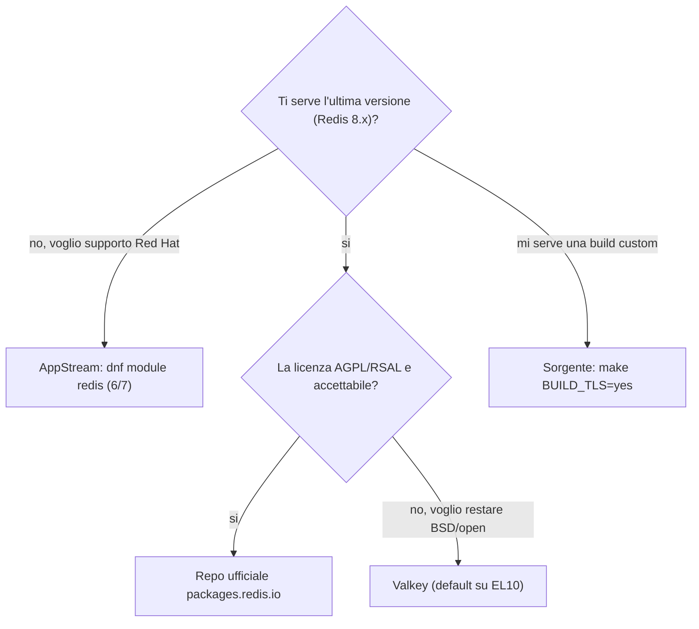

Obiettivo: installare un'istanza Redis su RHEL 9 e su macOS, con i diversi canali
di distribuzione, e capire il layout dei file su cui lavorerai nei moduli
successivi.

---

## 2.1 Scegliere la distribuzione

Su RHEL hai quattro strade. La scelta dipende da quanto ti serve l'ultima
versione e dai vincoli di compliance/licenza del tuo ambiente.

| Canale | Versione tipica | Quando usarlo |
|---|---|---|
| **Repo ufficiale Redis** (`packages.redis.io`) | Redis 8.x (ultima) | Vuoi le feature/patch recenti, accetti la licenza AGPL/RSAL |
| **AppStream RHEL** (`dnf module redis`) | Redis 6 / 7 | Vuoi pacchetti firmati e supportati da Red Hat, versione meno recente OK |
| **Remi** (`rpms.remirepo.net`) | Redis 7.2 / 8.x | Vuoi versioni recenti con confezionamento RPM "stile distro" |
| **Sorgente** (`download.redis.io`) | qualsiasi | Build custom (es. `BUILD_TLS=yes`), ambienti senza repo |
| **Valkey** | 9.x | Vuoi restare su licenza BSD/open; default su EL10 |

Su **macOS** la via standard è **Homebrew**; la build da sorgente è utile solo
per test specifici.



> In ambienti enterprise/banking conta la **provenienza firmata** e il supporto.
> Tipicamente: AppStream o un mirror interno per produzione, repo ufficiale Redis
> per avere le ultime versioni quando serve. Verifica sempre con il team
> sicurezza la licenza accettabile (AGPLv3 vs RSAL vs BSD/Valkey).

---

## 2.2 RHEL 9 — repo ufficiale Redis (Redis 8.x)

```bash
sudo tee /etc/yum.repos.d/redis.repo > /dev/null << 'EOF'
[Redis]
name=Redis
baseurl=https://packages.redis.io/rpm/rhel9
enabled=1
gpgcheck=1
gpgkey=https://packages.redis.io/gpg
EOF
```

```bash
curl -fsSL https://packages.redis.io/gpg | sudo tee /etc/pki/rpm-gpg/redis.gpg > /dev/null && sudo rpm --import /etc/pki/rpm-gpg/redis.gpg
```

```bash
sudo dnf install -y redis
```

Su Rocky/AlmaLinux sostituisci `rhel9` con `rockylinux9` / `almalinux9` nel
`baseurl`.

---

## 2.3 RHEL 9 — modulo AppStream (Redis 6/7 firmato Red Hat)

```bash
sudo dnf module list redis
```

```bash
sudo dnf module enable -y redis:7 && sudo dnf install -y redis
```

Se `redis:7` non è disponibile sulla tua minor release, usa `redis:6`. Questo
canale è il più "supportato" ma non ti dà Redis 8.

---

## 2.4 RHEL 9 — Remi (versioni recenti in stile distro)

```bash
sudo dnf install -y https://rpms.remirepo.net/enterprise/remi-release-9.rpm
```

```bash
sudo dnf module enable -y redis:remi-7.2 && sudo dnf install -y redis
```

---

## 2.5 RHEL 9 — build da sorgente (con TLS)

Utile quando ti serve una versione precisa o il supporto TLS compilato.

```bash
sudo dnf install -y gcc make tcl openssl-devel systemd-devel
```

```bash
cd /usr/local/src && sudo curl -fsSL https://download.redis.io/redis-stable.tar.gz -o redis-stable.tar.gz && sudo tar xzf redis-stable.tar.gz && cd redis-stable
```

```bash
sudo make BUILD_TLS=yes USE_SYSTEMD=yes && sudo make install
```

Verifica i binari (`redis-server`, `redis-cli`, `redis-sentinel`,
`redis-benchmark`, `redis-check-rdb`, `redis-check-aof`):

```bash
redis-server --version && redis-cli --version
```

Con la build da sorgente devi creare a mano utente di servizio, cartelle, unit
systemd e config (vedi 2.8 e 2.9).

---

## 2.6 macOS — Homebrew

```bash
brew install redis
```

Avvio come servizio (riparte al login) oppure in foreground per test:

```bash
brew services start redis
```

```bash
# alternativa in foreground, Ctrl-C per fermare
redis-server /opt/homebrew/etc/redis.conf
```

Verifica:

```bash
redis-cli ping
```

Su Mac Intel i percorsi Homebrew sono sotto `/usr/local` invece di
`/opt/homebrew`.

---

## 2.7 macOS — build da sorgente (opzionale)

```bash
brew install openssl
```

```bash
cd ~/src && curl -fsSL https://download.redis.io/redis-stable.tar.gz -o redis-stable.tar.gz && tar xzf redis-stable.tar.gz && cd redis-stable && make BUILD_TLS=yes
```

I binari restano in `src/`; per i lab puoi lanciarli con percorso esplicito
(`./src/redis-server`).

---

## 2.8 Layout dei file dopo l'installazione

Dipende dal canale. I percorsi di riferimento del corso:

| Elemento | RHEL (RPM) | macOS (Homebrew, Apple Silicon) |
|---|---|---|
| Config | `/etc/redis/redis.conf` | `/opt/homebrew/etc/redis.conf` |
| Dati (dir) | `/var/lib/redis` | `/opt/homebrew/var/db/redis/` |
| Log | `/var/log/redis/redis.log` | `/opt/homebrew/var/log/redis.log` |
| Binari | `/usr/bin/redis-*` | `/opt/homebrew/bin/redis-*` |
| Unit systemd | `/usr/lib/systemd/system/redis.service` | n/d (usa `launchd`/`brew services`) |
| Utente di servizio | `redis` | utente corrente |

> Attenzione: alcune guide datate citano `/etc/redis.conf` (file singolo). Sui
> pacchetti RHEL 8/9 e sul repo ufficiale la config sta in **`/etc/redis/`**.
> Verifica sempre con `systemctl cat redis` qual è il file effettivamente usato.

Individua i percorsi reali a runtime:

```bash
redis-cli CONFIG GET dir && redis-cli CONFIG GET logfile && redis-cli CONFIG GET dbfilename
```

---

## 2.9 Avvio, abilitazione al boot e verifica (RHEL)

I pacchetti RHEL **non** avviano Redis automaticamente:

```bash
sudo systemctl enable --now redis
```

```bash
systemctl status redis --no-pager
```

```bash
redis-cli ping        # atteso: PONG
```

```bash
redis-cli INFO server | head -n 20
```

Se hai fatto la build da sorgente, crea l'unit minimale:

```bash
sudo tee /etc/systemd/system/redis.service > /dev/null << 'EOF'
[Unit]
Description=Redis
After=network.target

[Service]
ExecStart=/usr/local/bin/redis-server /etc/redis/redis.conf --supervised systemd
ExecStop=/usr/local/bin/redis-cli shutdown
Type=notify
User=redis
Group=redis
RuntimeDirectory=redis
RuntimeDirectoryMode=0755

[Install]
WantedBy=multi-user.target
EOF
```

```bash
sudo useradd --system --no-create-home --shell /sbin/nologin redis 2>/dev/null; sudo mkdir -p /etc/redis /var/lib/redis /var/log/redis && sudo chown -R redis:redis /var/lib/redis /var/log/redis
```

```bash
sudo systemctl daemon-reload && sudo systemctl enable --now redis
```

Nota: con `supervised systemd` + `Type=notify`, **non** impostare anche
`daemonize yes` nel `redis.conf` (sarebbe in conflitto).

---

## 2.10 Primo smoke test funzionale

```bash
redis-cli set corso:hello "ciao" EX 60
```

```bash
redis-cli get corso:hello
```

```bash
redis-cli TTL corso:hello
```

```bash
redis-cli INFO keyspace
```

---

## 2.11 Disinstallazione / pulizia

```bash
# RHEL (RPM)
sudo systemctl disable --now redis && sudo dnf remove -y redis
```

```bash
# macOS
brew services stop redis && brew uninstall redis
```

I dati persistenti (`dump.rdb`, file AOF) **non** vengono rimossi
automaticamente: cancellali a mano dalla `dir` se vuoi un ambiente pulito.

---

### Prossimo passo

Hai un'istanza viva ma con la configurazione di default (insicura per la rete).
Vai al modulo [03 — Configurazione e sicurezza](03-configurazione-sicurezza.md)
e al **Lab 1** nel modulo [09](09-lab.md).
