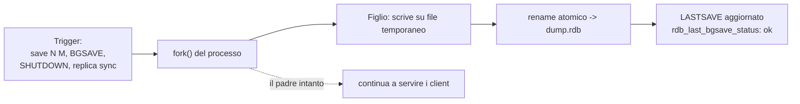
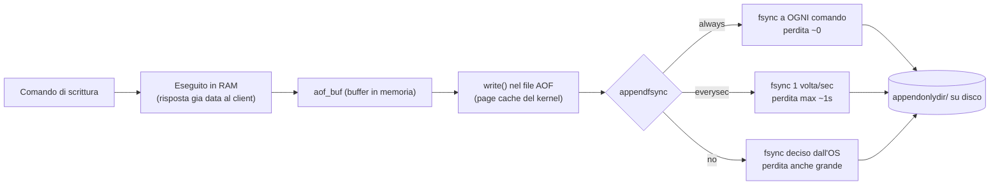
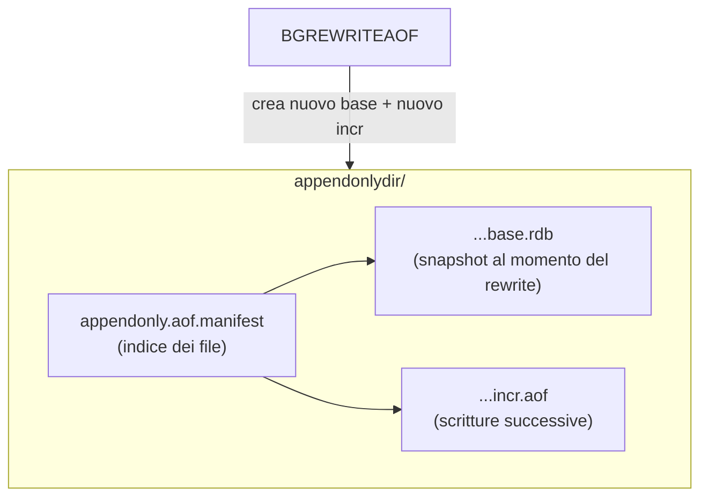
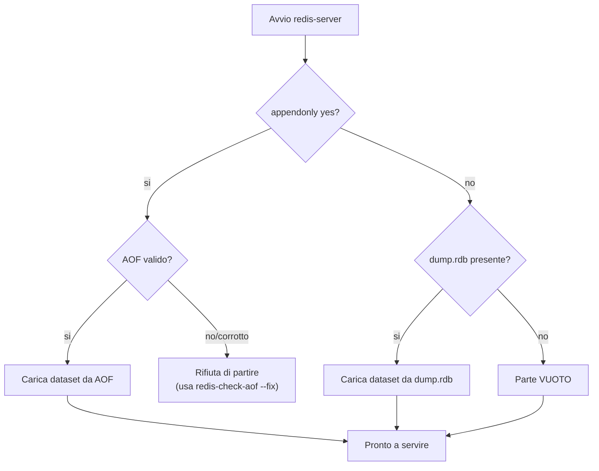

Obiettivo: capire RDB e AOF, configurarli, sapere cosa succede al riavvio e
scegliere la strategia giusta per cache vs datastore primario.

---

## 4.1 Le due forme di persistenza

| | RDB | AOF |
|---|---|---|
| Cosa | Snapshot binario del dataset | Log di tutte le scritture |
| File | `dump.rdb` | `appendonly.aof` (multi-file da 7.x) |
| Dimensione | Compatto | Più grande |
| Ripristino | Veloce | Più lento (rigioca le scritture) |
| Perdita dati | Tra uno snapshot e l'altro | Al massimo ~1s (con `everysec`) |
| Impatto runtime | Fork periodico (COW) | Scrittura continua + rewrite periodico |

Sono **indipendenti e combinabili**. La scelta non è "o l'uno o l'altro" ma quale
livello di durabilità ti serve.

---

## 4.2 RDB — snapshot

### Configurazione

```ini
# in redis.conf
dir /var/lib/redis
dbfilename dump.rdb
save 3600 1 300 100 60 10000   # snapshot se: 1 modifica in 3600s, 100 in 300s, 10000 in 60s
rdbcompression yes
rdbchecksum yes
stop-writes-on-bgsave-error yes
```

`save` definisce le **soglie automatiche**. Per disabilitare gli snapshot
automatici (cache pura):

```bash
redis-cli CONFIG SET save ""
```

### Snapshot manuale

```bash
redis-cli BGSAVE          # snapshot in background (fork), NON blocca
```

```bash
redis-cli LASTSAVE        # timestamp Unix dell'ultimo salvataggio riuscito
```

```bash
redis-cli SAVE            # snapshot sincrono: BLOCCA l'istanza, usalo solo a freddo
```

> **Mai `SAVE` su un'istanza in produzione**: blocca il command processing finché
> non ha finito. Usa sempre `BGSAVE`.

### Come funziona il fork (COW)

`BGSAVE` fa `fork()`: il processo figlio scrive lo snapshot mentre il padre
continua a servire i client. Il costo è memoria extra proporzionale alle
scritture durante lo snapshot (copy-on-write). Su dataset grandi e write-heavy il
fork può causare un picco di latenza e di RAM: è uno dei motivi per cui serve RAM
libera (modulo 01) e `vm.overcommit_memory=1` (modulo 07).



Il `rename` finale è **atomico**: o vedi il vecchio `dump.rdb` o il nuovo, mai un
file a metà. Per questo l'RDB è ideale come unità di backup (modulo 08).

---

## 4.3 AOF — append only file

### Configurazione

```ini
# in redis.conf
appendonly yes
appendfsync everysec        # always | everysec | no
appenddirname "appendonlydir"
auto-aof-rewrite-percentage 100
auto-aof-rewrite-min-size 64mb
aof-use-rdb-preamble yes
```

Le tre politiche di `appendfsync`:

| Valore | Durabilità | Performance | Uso |
|---|---|---|---|
| `always` | Massima (ogni scrittura su disco) | Più lento | Dati critici, raro |
| `everysec` | Perdi al massimo ~1s | Ottimo compromesso | **Default consigliato** |
| `no` | Lascia decidere all'OS | Massima velocità | Sconsigliato per durabilità |

Il percorso di una scrittura con AOF (capire dove sta la finestra di perdita
dati): il comando viene prima eseguito in RAM, poi accodato in un buffer
(`aof_buf`), che viene scritto sul file e infine **sincronizzato su disco**
(`fsync`) secondo la politica. La perdita possibile è tutto ciò che è nel buffer
ma non ancora `fsync`-ato quando il sistema crasha.



> Sottigliezza importante: `write()` mette i dati nella *page cache* del kernel,
> non sul disco fisico. È `fsync()` che forza la scrittura durevole. Con
> `appendfsync no` puoi avere il file "scritto" ma perdere comunque dati a un
> crash del sistema, perché l'OS non ha ancora fatto flush.

### AOF rewrite

L'AOF cresce indefinitamente; il **rewrite** lo ricompatta riscrivendo lo stato
corrente in modo minimale. Avviene automaticamente quando il file cresce oltre la
percentuale configurata, oppure manualmente:

```bash
redis-cli BGREWRITEAOF
```

Da Redis 7 l'AOF è **multi-part** dentro `appendonlydir/` (un file base in
formato RDB + file incrementali + un manifest): non stupirti di vedere più file.



Il **rewrite** crea un nuovo file *base* (stato corrente compattato) e riparte con
un nuovo *incr*; i vecchi file vengono eliminati. Così l'AOF non cresce
all'infinito pur restando durevole.

### Verificare lo stato

```bash
redis-cli INFO persistence | grep -E 'aof_enabled|aof_last_bgrewrite_status|aof_last_write_status|aof_rewrite_in_progress|aof_base_size|aof_current_size'
```

---

## 4.4 Combinare RDB + AOF

Strategia tipica per datastore: **entrambi attivi**. AOF garantisce durabilità
fine; RDB dà uno snapshot compatto utile per backup e ripristini veloci. Con
`aof-use-rdb-preamble yes` il file base dell'AOF è già in formato RDB, unendo i
vantaggi.

Al riavvio, **se AOF è abilitato Redis ricarica dall'AOF** (più aggiornato),
altrimenti dall'RDB.

---

## 4.5 Cache pura: nessuna persistenza

Se Redis è solo cache sacrificabile, puoi disabilitare tutto per massimizzare le
performance ed evitare i fork:

```ini
save ""
appendonly no
```

Conseguenza: a un riavvio il dataset è vuoto. Va benissimo per una cache, è
inaccettabile per un session store o un datastore primario.

---

## 4.6 Cosa succede al riavvio e come ripristinare

1. Redis legge la `dir`.
2. Se `appendonly yes` → carica da `appendonlydir/`.
3. Altrimenti → carica `dump.rdb`.
4. Se i file sono corrotti, Redis rifiuta di partire.



> La regola "se AOF è attivo vince l'AOF" è la causa di un errore frequente in
> fase di restore: copi un `dump.rdb` di backup ma Redis riparte dall'AOF e ignora
> il tuo file. Soluzione nel paragrafo 4.6 e nel modulo 08.

### Validare/riparare i file

```bash
redis-check-rdb /var/lib/redis/dump.rdb
```

```bash
redis-check-aof /var/lib/redis/appendonlydir/appendonly.aof.manifest
```

Per provare a riparare un AOF troncato (interattivo, fa una copia):

```bash
redis-check-aof --fix /var/lib/redis/appendonlydir/appendonly.aof.1.incr.aof
```

### Ripristino manuale di uno snapshot

A istanza **ferma**, copia il file e riavvia:

```bash
sudo systemctl stop redis && sudo cp /backup/dump-20260610.rdb /var/lib/redis/dump.rdb && sudo chown redis:redis /var/lib/redis/dump.rdb && sudo systemctl start redis
```

> Se devi ripristinare un RDB ma hai l'AOF attivo, Redis ignorerebbe l'RDB. O
> disabiliti temporaneamente l'AOF, oppure abiliti l'AOF a caldo *dopo* aver
> caricato l'RDB con `CONFIG SET appendonly yes` (che genera un nuovo AOF dallo
> stato corrente).

---

## 4.7 Errori comuni di persistenza

- **`MISCONF Redis is configured to save RDB snapshots but ...`**: con
  `stop-writes-on-bgsave-error yes`, se l'ultimo `BGSAVE` è fallito (disco pieno,
  permessi) Redis **blocca le scritture**. Diagnosi nel modulo 08. Risolvi la
  causa (spazio/permessi) e verifica `rdb_last_bgsave_status`.
- **Fork fallito per memoria**: senza `vm.overcommit_memory=1` il `fork()` può
  fallire quando used_memory è alta. Vedi modulo 07.
- **Disco lento → latenza**: `appendfsync always` su disco lento blocca; misura
  con la sezione LATENCY (modulo 07).

Stato sintetico:

```bash
redis-cli INFO persistence | grep -E 'rdb_last_bgsave_status|rdb_last_save_time|aof_last_write_status|loading'
```

---

### Prossimo passo

Modulo [05 — Replica e Sentinel](05-replica-sentinel.md). Lab: **Lab 2**
(persistenza e recovery) nel modulo [09](09-lab.md).
