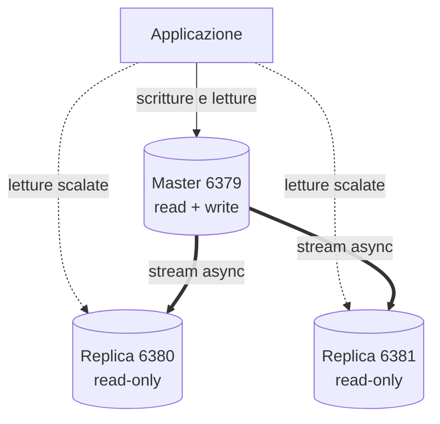
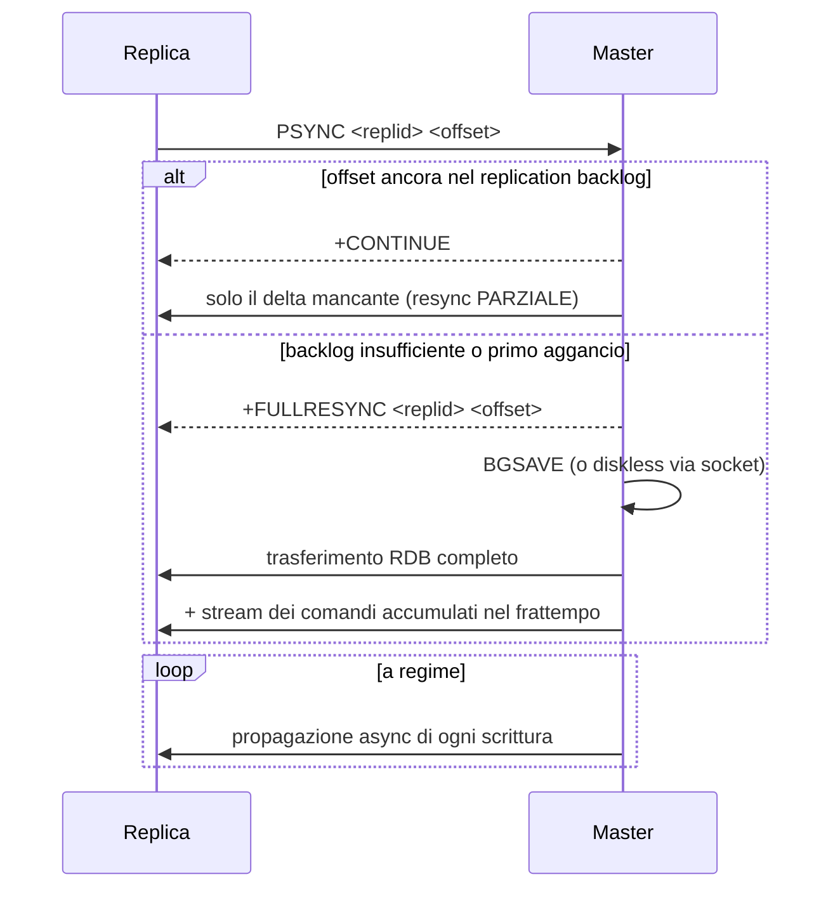
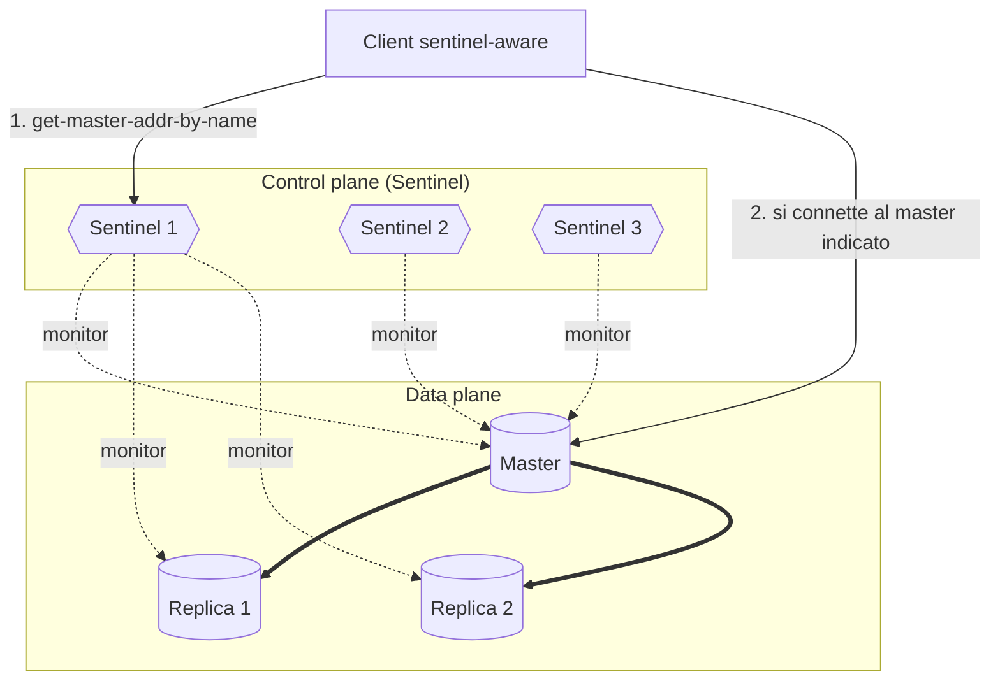
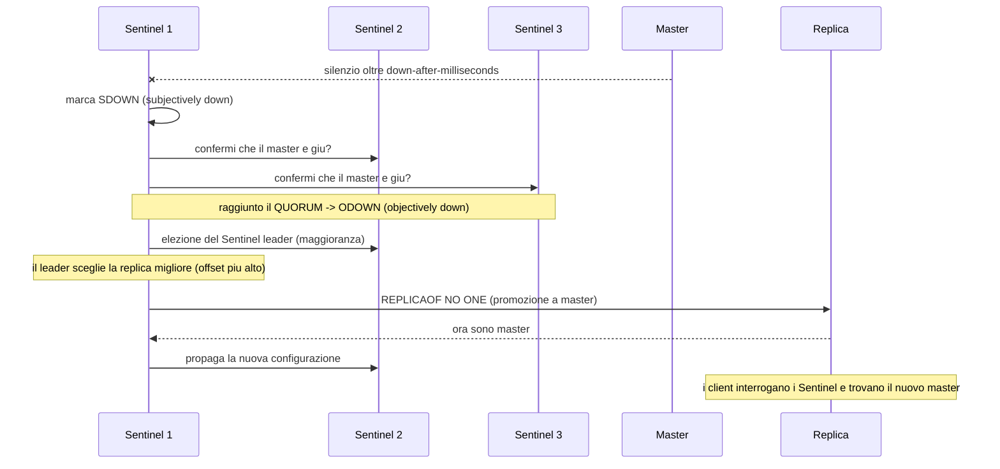

Obiettivo: configurare la replica master→replica e costruire un'alta
disponibilità con failover automatico usando Redis Sentinel.

---

## 5.1 La replica in Redis

La replica è **asincrona**: un master invia il flusso delle modifiche a una o più
**replica** (storicamente "slave"). Le replica sono di default in **sola
lettura** e servono a: scalare le letture, avere copie a caldo, e fare da base
per il failover.

Punti chiave operativi:

- Asincrona ⇒ una replica può essere leggermente indietro (lag). In caso di
  failover puoi perdere le ultime scritture non ancora replicate.
- **`PSYNC`**: alla connessione, la replica tenta una **resync parziale** (recupera
  solo il delta dal *replication backlog*); se non possibile, fa una **full
  resync** (il master genera un RDB e lo invia).
- **Diskless sync**: il master può inviare l'RDB direttamente via socket senza
  scriverlo su disco (`repl-diskless-sync yes`), utile su dischi lenti.

Topologia di base (un master scrivibile, N replica in sola lettura):



Cosa succede quando una replica si connette (handshake PSYNC):



> Il **replication backlog** è un buffer circolare sul master (dimensione
> `repl-backlog-size`). Se una replica si disconnette e torna entro la finestra
> coperta dal backlog, recupera con una resync *parziale* (economica). Se resta
> giù troppo a lungo, il backlog "scorre via" e serve una *full resync* (costosa:
> nuovo RDB + trasferimento completo). Su workload con molte scritture o reti
> instabili, **aumentare `repl-backlog-size`** riduce le full resync.

---

## 5.2 Configurare una replica

Sul nodo che deve diventare replica (a runtime):

```bash
redis-cli -p 6380 REPLICAOF 127.0.0.1 6379
```

Se il master ha autenticazione, sulla replica serve anche:

```bash
redis-cli -p 6380 CONFIG SET masterauth 'PasswordMaster!'
```

Versione da file (`redis.conf` della replica):

```ini
replicaof 127.0.0.1 6379
masterauth PasswordMaster!
replica-read-only yes
repl-backlog-size 64mb
repl-diskless-sync yes
```

Per "promuovere" una replica a master autonomo (rompendo la replica):

```bash
redis-cli -p 6380 REPLICAOF NO ONE
```

---

## 5.3 Monitorare la replica

Sul master:

```bash
redis-cli INFO replication
```

Cerca: `role:master`, `connected_slaves:N`, e per ogni replica una riga
`slave0:ip=...,state=online,offset=...,lag=...`.

Sulla replica:

```bash
redis-cli -p 6380 INFO replication | grep -E 'role|master_link_status|master_last_io_seconds_ago|master_sync_in_progress|slave_repl_offset'
```

Indicatori importanti:

- **`master_link_status:up`**: il link è attivo. Se `down`, la replica non sta
  ricevendo aggiornamenti.
- **lag / `master_last_io_seconds_ago`**: quanto è indietro/silenziosa la replica.
- Differenza `master_repl_offset` (master) vs `slave_repl_offset` (replica) = byte
  di ritardo.

### Garanzie di scrittura minime

Per ridurre la finestra di perdita dati, puoi rifiutare le scritture se non ci
sono abbastanza replica agganciate:

```ini
min-replicas-to-write 1
min-replicas-max-lag 10
```

Così il master smette di accettare scritture se non ha almeno 1 replica con lag
< 10s. È una scelta di consistenza vs disponibilità: valutala in base al caso.

> **Split-brain e perdita di scritture.** Poiché la replica è asincrona, in un
> failover le scritture accettate dal vecchio master ma non ancora propagate
> vengono **perse**. Peggio: se il vecchio master è solo *isolato* (non morto) e
> continua ad accettare scritture mentre i Sentinel ne promuovono un altro, hai
> due master per un istante (split-brain). `min-replicas-to-write` mitiga il
> problema: un master isolato che perde le sue replica smette da solo di accettare
> scritture, riducendo la finestra di divergenza. È il classico trade-off
> CAP: con Redis async non hai consistenza forte, scegli quanto rischio di
> perdita accettare.

---

## 5.4 Perché serve Sentinel

La replica da sola **non** fa failover: se il master muore, qualcuno deve
accorgersene, promuovere una replica a master e dire ai client dove trovarla.
Questo è il compito di **Redis Sentinel**.

Sentinel è un processo separato (`redis-sentinel`) che:

1. **Monitora** master e replica.
2. Rileva un master `down` quando un **quorum** di Sentinel concorda.
3. **Promuove** una replica a master (failover automatico).
4. **Notifica** ai client il nuovo master (i client chiedono ai Sentinel
   l'indirizzo del master).

> Sentinel ⇒ alta disponibilità di un dataset che sta su un singolo master (non
> sharding). Se ti serve scalare *oltre la RAM/un core* spartendo i dati, quello
> è **Redis Cluster** (modulo 06). Sentinel e Cluster sono soluzioni diverse a
> problemi diversi.

Servono **almeno 3 Sentinel** (numero dispari) per avere un quorum affidabile e
tollerare la perdita di uno di essi.



> Sentinel ⇒ alta disponibilità di un dataset che sta su un singolo master (non
> sharding). Se ti serve scalare *oltre la RAM/un core* spartendo i dati, quello
> è **Redis Cluster** (modulo 06). Sentinel e Cluster sono soluzioni diverse a
> problemi diversi.

### Anatomia di un failover



> **Quorum vs maggioranza** (distinzione che confonde spesso): il `quorum` serve a
> dichiarare il master *objectively down*; ma per **autorizzare** il failover
> serve comunque la **maggioranza** dei Sentinel totali. Con 3 Sentinel e quorum
> 2, basta che 2 vedano il master giù *e* che la maggioranza (2) sia viva. Per
> questo i Sentinel vanno dispari e su host/AZ diversi: 2 Sentinel sullo stesso
> host che muore non possono fare failover.

---

## 5.5 Configurare Sentinel

File `sentinel.conf` minimale (uno per ciascun Sentinel; cambia solo la `port`):

```ini
port 26379
sentinel monitor mymaster 127.0.0.1 6379 2
sentinel down-after-milliseconds mymaster 5000
sentinel failover-timeout mymaster 60000
sentinel parallel-syncs mymaster 1
# se i Redis hanno auth:
sentinel auth-pass mymaster PasswordMaster!
```

Significato dei parametri:

- **`monitor mymaster <ip> <port> <quorum>`**: monitora il master chiamandolo
  `mymaster`; servono `quorum` Sentinel d'accordo per dichiararlo morto. Con 3
  Sentinel, quorum 2 è la scelta tipica.
- **`down-after-milliseconds`**: dopo quanti ms di silenzio il master è
  considerato "soggettivamente" giù da un Sentinel.
- **`failover-timeout`**: timeout complessivo della procedura di failover.
- **`parallel-syncs`**: quante replica risincronizzano contemporaneamente col
  nuovo master (1 = una alla volta, per non saturare).

Avvio:

```bash
redis-sentinel /etc/redis/sentinel.conf
```

Sentinel **riscrive** il proprio file di config a runtime (per ricordare lo stato
del cluster): è normale che `sentinel.conf` venga modificato.

---

## 5.6 Interrogare e testare Sentinel

Chiedere a un Sentinel chi è il master corrente (è così che i client lo trovano):

```bash
redis-cli -p 26379 SENTINEL get-master-addr-by-name mymaster
```

```bash
redis-cli -p 26379 SENTINEL master mymaster
```

```bash
redis-cli -p 26379 SENTINEL replicas mymaster
```

```bash
redis-cli -p 26379 SENTINEL sentinels mymaster
```

### Simulare un failover

Forzare il failover manualmente (utile per test e per drill di manutenzione):

```bash
redis-cli -p 26379 SENTINEL failover mymaster
```

Oppure uccidere/sospendere il master e osservare: dopo `down-after-milliseconds`
+ accordo del quorum, una replica viene promossa. Verifica con
`get-master-addr-by-name` che l'indirizzo sia cambiato.

> Quando il vecchio master torna su, Sentinel lo riconfigura automaticamente come
> **replica** del nuovo master.

---

## 5.7 Lato client

I client correttamente integrati con Sentinel **non** si connettono al master per
IP fisso: chiedono ai Sentinel l'indirizzo del master e si riconnettono al nuovo
in caso di failover. Operativamente questo significa che i tuoi servizi devono
usare una libreria client "sentinel-aware" e puntare alla **lista dei Sentinel**,
non al master diretto. È un requisito d'architettura da verificare con gli
sviluppatori.

---

## 5.8 Topologia di riferimento (per il lab)

Tutto su una macchina, porte diverse:

| Ruolo | Porta |
|---|---|
| Master | 6379 |
| Replica 1 | 6380 |
| Replica 2 | 6381 |
| Sentinel 1 | 26379 |
| Sentinel 2 | 26380 |
| Sentinel 3 | 26381 |

In produzione distribuisci i 3 nodi (e i 3 Sentinel) su **host/AZ diversi**,
altrimenti l'HA è solo apparente.

---

### Prossimo passo

Modulo [06 — Redis Cluster](06-cluster.md). Lab: **Lab 4** (replica + Sentinel +
failover) nel modulo [09](09-lab.md).
