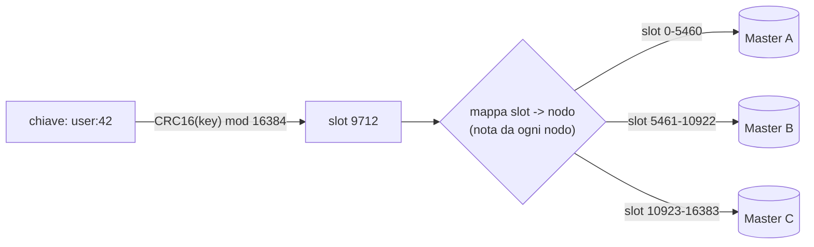
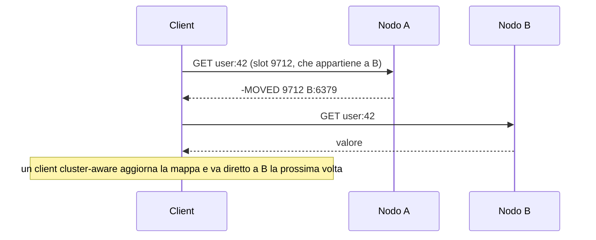
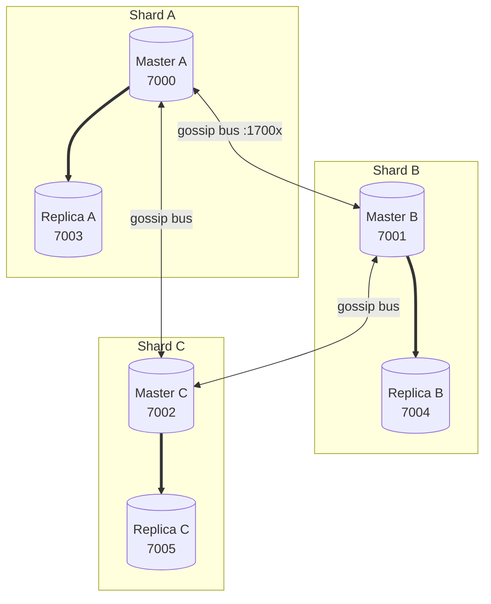
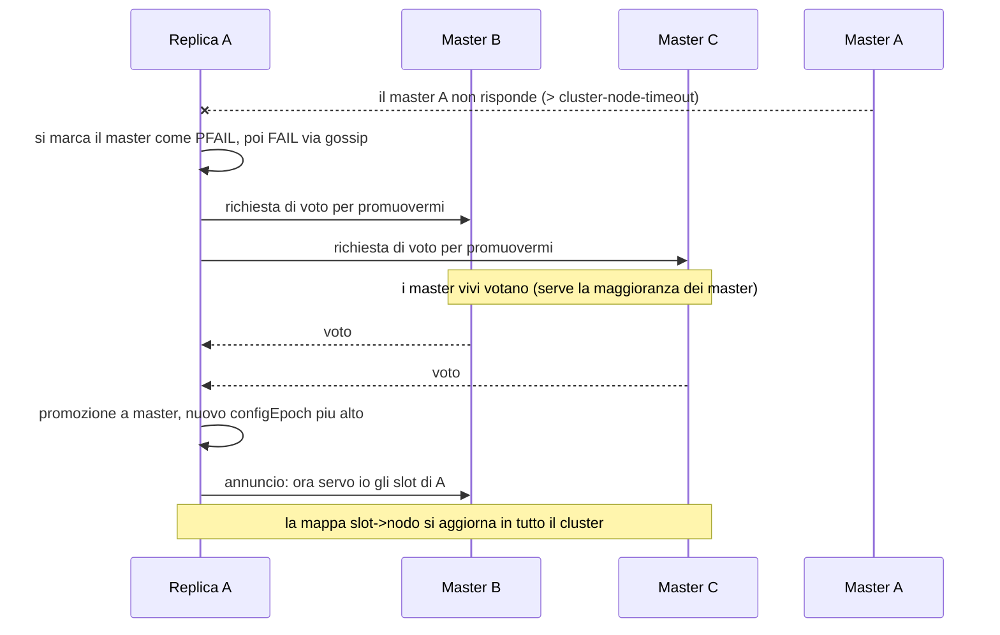

Obiettivo: capire lo sharding a hash slot, creare un cluster, gestirlo
(reshard, aggiunta/rimozione nodi, failover) e conoscerne i limiti operativi.

---

## 6.1 Perché un cluster

Sentinel dà HA ma il dataset resta su **un singolo master**: sei limitato dalla
RAM di un nodo e dal throughput di un core. **Redis Cluster** risolve questo
spartendo i dati su **più master** (sharding) e fornendo al contempo HA (ogni
master ha le sue replica).

Usa il cluster quando: il dataset non sta nella RAM di un nodo, o il throughput
supera ciò che un'istanza regge, o vuoi sia scaling sia HA in un'unica
soluzione.

---

## 6.2 Hash slot e routing

Lo spazio delle chiavi è diviso in **16384 hash slot**. Ogni chiave è assegnata a
uno slot con `CRC16(key) mod 16384`. Ogni master è responsabile di un
sottoinsieme contiguo di slot.



- Quando un client contatta il nodo sbagliato per una chiave, riceve un redirect
  **`MOVED`** (slot ora su un altro nodo) o **`ASK`** (durante una migrazione).
  Un client *cluster-aware* segue i redirect automaticamente e mantiene una mappa
  slot→nodo.



- **Hash tag**: per forzare più chiavi sullo stesso slot (necessario per
  operazioni multi-chiave), usa le graffe: `{user:1000}:profile` e
  `{user:1000}:sessions` finiscono nello **stesso** slot perché solo `user:1000`
  viene hashato.

> **Perché 16384 e non 65536?** Ogni nodo, nei messaggi gossip, scambia un bitmap
> degli slot che possiede. 16384 bit = 2 KB per messaggio: un buon compromesso tra
> granularità del bilanciamento e dimensione del traffico di controllo. È un
> dettaglio che spiega perché il numero è fisso e perché cluster con poche decine
> di master sono lo sweet spot.

### Limiti operativi da conoscere

- I comandi **multi-chiave** (`MSET`, `SINTERSTORE`, transazioni, script Lua con
  più chiavi) funzionano solo se tutte le chiavi sono nello **stesso slot** →
  usa gli hash tag.
- Esiste **solo il DB 0** (niente `SELECT 1..15`).
- Topologia minima consigliata: **3 master + 3 replica** (un cluster con < 3
  master non ha senso pratico e non gestisce bene il failover).

---

## 6.3 Bus di cluster e requisiti di rete

Ogni nodo usa due porte: la porta client (es. 6379) e la **cluster bus port** =
client **+ 10000** (es. 16379) per il protocollo gossip tra nodi. Entrambe devono
essere raggiungibili **tra tutti i nodi**. Errore classico: aprire solo 6379 nel
firewall e non 16379 → il cluster non si forma.



Le frecce piene `==>` sono la **replicazione** (dati); le frecce `<-->` sono il
**bus di gossip** (controllo: chi è vivo, chi possiede quali slot, chi è leader in
un failover). In produzione i due nodi di ogni shard vanno su **host/AZ diversi**,
altrimenti un guasto singolo porta giù sia master sia replica di quello shard.

---

## 6.4 Configurazione dei nodi

Ogni istanza che fa parte del cluster necessita (`redis.conf`):

```ini
port 7000
cluster-enabled yes
cluster-config-file nodes-7000.conf
cluster-node-timeout 5000
appendonly yes
dir /var/lib/redis/7000
```

`cluster-config-file` è gestito **automaticamente** da Redis (non lo editi a
mano): contiene lo stato del cluster visto da quel nodo.

Per il lab su una sola macchina si lanciano 6 istanze su porte 7000–7005, ognuna
con la sua `dir`. Redis include uno script di comodo
(`utils/create-cluster/create-cluster`) per fare tutto questo automaticamente;
nel lab vedrai sia il metodo automatico sia quello manuale.

---

## 6.5 Creare il cluster

Con le 6 istanze già avviate (3 master + 3 replica, `--cluster-replicas 1`):

```bash
redis-cli --cluster create 127.0.0.1:7000 127.0.0.1:7001 127.0.0.1:7002 127.0.0.1:7003 127.0.0.1:7004 127.0.0.1:7005 --cluster-replicas 1
```

`redis-cli --cluster` ha sostituito il vecchio `redis-trib.rb`: assegna gli slot,
designa master e replica e chiede conferma del piano. Con auth aggiungi
`-a <password>` (o `--askpass`).

---

## 6.6 Ispezionare il cluster

```bash
redis-cli -p 7000 CLUSTER INFO
```

```bash
redis-cli -p 7000 CLUSTER NODES
```

```bash
redis-cli -p 7000 CLUSTER SHARDS
```

Controllo di salute e copertura slot dall'esterno:

```bash
redis-cli --cluster check 127.0.0.1:7000
```

```bash
redis-cli --cluster info 127.0.0.1:7000
```

In `CLUSTER INFO` vuoi vedere `cluster_state:ok` e
`cluster_slots_assigned:16384`. Se `cluster_state:fail`, mancano slot o troppi
master sono giù (modulo 08).

---

## 6.7 Usare il cluster dalla CLI

`redis-cli` da solo non segue i redirect; aggiungi `-c` per la modalità cluster:

```bash
redis-cli -c -p 7000
```

```bash
# dentro la sessione: nota gli eventuali messaggi "Redirected to slot ..."
set chiave1 valore1
get chiave1
```

Capire dove finisce una chiave:

```bash
redis-cli -p 7000 CLUSTER KEYSLOT chiave1
```

---

## 6.8 Scaling: reshard, add/remove nodi

### Aggiungere un master e ribilanciare

```bash
redis-cli --cluster add-node 127.0.0.1:7006 127.0.0.1:7000
```

Il nuovo nodo entra **senza slot**. Assegnagli slot (resharding interattivo):

```bash
redis-cli --cluster reshard 127.0.0.1:7000
```

Oppure ribilancia automaticamente tra tutti i master:

```bash
redis-cli --cluster rebalance 127.0.0.1:7000
```

### Aggiungere una replica a un master

```bash
redis-cli --cluster add-node 127.0.0.1:7007 127.0.0.1:7000 --cluster-slave --cluster-master-id <master-node-id>
```

(il `<master-node-id>` lo leggi da `CLUSTER NODES`).

### Rimuovere un nodo

Prima sposta via gli slot (reshard a 0), poi:

```bash
redis-cli --cluster del-node 127.0.0.1:7000 <node-id>
```

Non puoi rimuovere un master che detiene ancora slot: prima lo svuoti con un
reshard.

---

## 6.9 Failover nel cluster

Ogni master ha replica; se un master muore, le sue replica (con accordo della
maggioranza dei master) **promuovono** una di loro. È un meccanismo interno
(niente Sentinel nel cluster).



> **configEpoch**: ogni cambio di proprietà degli slot porta un numero di epoca
> crescente. Se due nodi rivendicano lo stesso slot, **vince l'epoca più alta**.
> È il meccanismo che risolve i conflitti dopo partizioni di rete senza un
> coordinatore esterno. Per questo le promozioni sono autorizzate dalla
> **maggioranza dei master**: un gruppo minoritario isolato non può promuovere e
> divergere.

Failover manuale, da eseguire **su una replica** (utile per manutenzione del
master senza downtime):

```bash
redis-cli -p 7003 CLUSTER FAILOVER
```

Varianti: `CLUSTER FAILOVER FORCE` / `TAKEOVER` per scenari in cui il master è
irraggiungibile (usale con cautela: possono causare perdita dati).

> Importante: il cluster resta disponibile finché **ogni slot ha un master
> vivo**. Se perdi un master e tutte le sue replica, gli slot di quel master
> diventano non serviti e (di default) `cluster_state:fail` blocca l'intero
> cluster. La distribuzione master/replica su host e AZ diversi è quindi
> essenziale.

---

## 6.10 Manutenzione e upgrade

- **Upgrade rolling**: aggiorna prima le replica una alla volta, poi fai
  `CLUSTER FAILOVER` su una replica per promuoverla, aggiorna il vecchio master
  (ora replica), e prosegui shard per shard. Dettaglio nel modulo 08.
- Tieni `cluster-node-timeout` coerente con la latenza di rete reale: troppo
  basso ⇒ failover spurî; troppo alto ⇒ rilevamento lento dei guasti.
- Backup: si fa **per nodo** (ogni master ha la sua porzione di dati). Vedi
  modulo 08.

---

## 6.11 Cluster vs Sentinel — riepilogo decisionale

| Esigenza | Soluzione |
|---|---|
| HA su dataset che sta in un nodo | Replica + **Sentinel** |
| Dataset > RAM di un nodo / sharding | **Cluster** |
| Solo scaling letture | Replica read-only |
| Multi-key / transazioni semplici su tutto il keyspace | Standalone (o hash tag nel cluster) |

---

### Prossimo passo

Modulo [07 — Monitoring e tuning](07-monitoring-tuning.md). Lab: **Lab 5**
(cluster, reshard, node failure) nel modulo [09](09-lab.md).
