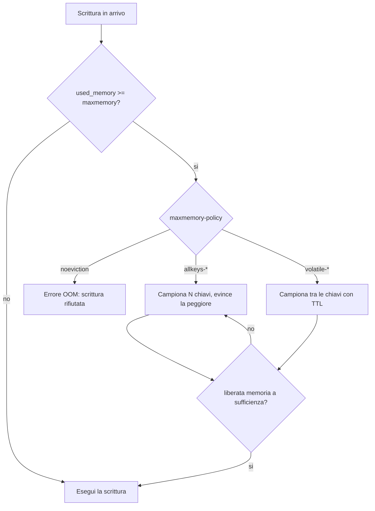
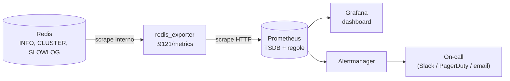

Obiettivo: leggere lo stato di Redis con gli strumenti nativi, individuare i
problemi di latenza e memoria, applicare il tuning di OS e Redis, ed esporre le
metriche a Prometheus.

---

## 7.1 `INFO`: la fonte primaria

`INFO` è il punto di partenza di ogni diagnosi. Sezioni utili:

```bash
redis-cli INFO server       # versione, uptime, pid, config_file
redis-cli INFO clients      # connessioni, blocked_clients
redis-cli INFO memory       # used_memory, frammentazione, maxmemory
redis-cli INFO persistence  # stato RDB/AOF
redis-cli INFO stats        # ops/sec, hit/miss, evicted, rejected
redis-cli INFO replication  # ruolo, replica, offset
redis-cli INFO cpu          # CPU usata
redis-cli INFO keyspace     # n. chiavi per DB
```

### Metriche da tenere d'occhio (e perché)

| Metrica | Sezione | Cosa indica / soglia |
|---|---|---|
| `used_memory` / `maxmemory` | memory | Quanto sei vicino al limite |
| `mem_fragmentation_ratio` | memory | >1.5 frammentazione; <1.0 **swap** (grave) |
| `evicted_keys` | stats | Chiavi rimosse per `maxmemory` → dataset troppo grande |
| `keyspace_hits` / `keyspace_misses` | stats | Hit ratio della cache |
| `expired_keys` | stats | Chiavi scadute (normale) |
| `instantaneous_ops_per_sec` | stats | Carico corrente |
| `rejected_connections` | stats | Hai sforato `maxclients`/fd |
| `connected_clients` / `blocked_clients` | clients | Client attivi/bloccati |
| `rdb_last_bgsave_status` | persistence | `ok`/`err` ultimo snapshot |
| `aof_last_write_status` | persistence | Stato scrittura AOF |
| `master_link_status` | replication | `up`/`down` sul replica |
| `latest_fork_usec` | stats | Durata ultimo fork (picco latenza) |

Hit ratio calcolato al volo:

```bash
redis-cli INFO stats | awk -F: '/keyspace_hits/{h=$2} /keyspace_misses/{m=$2} END{printf "hit ratio: %.2f%%\n", h/(h+m)*100}'
```

---

## 7.2 Strumenti `redis-cli` per la diagnosi

Statistiche live (come `vmstat`):

```bash
redis-cli --stat
```

Misura la latenza verso il server (ping continui):

```bash
redis-cli --latency
```

```bash
redis-cli --latency-history
```

Latenza **intrinseca** del sistema (CPU/kernel, non rete) — eseguila sull'host del
server:

```bash
redis-cli --intrinsic-latency 5
```

Trova i **big key** (campiona il keyspace):

```bash
redis-cli --bigkeys
```

```bash
redis-cli --memkeys
```

Trova le **hot key** (richiede `maxmemory-policy` LFU):

```bash
redis-cli --hotkeys
```

> **`MONITOR`** mostra ogni comando in tempo reale ma **degrada le performance**:
> usalo per debug breve, mai lasciarlo attivo in produzione.
> ```bash
> redis-cli MONITOR
> ```

---

## 7.3 SLOWLOG: i comandi lenti

Redis registra i comandi che superano una soglia:

```bash
redis-cli CONFIG SET slowlog-log-slower-than 10000   # microsecondi (10ms)
```

```bash
redis-cli CONFIG SET slowlog-max-len 256
```

```bash
redis-cli SLOWLOG GET 10
```

```bash
redis-cli SLOWLOG RESET
```

Ogni voce mostra timestamp, durata, comando e argomenti. È il primo posto dove
guardare quando la latenza sale: spesso trovi `KEYS`, `SMEMBERS`/`HGETALL` su big
key, o script Lua pesanti.

---

## 7.4 LATENCY monitoring

Redis ha un framework dedicato agli **eventi di latenza** (fork, espirazioni,
comandi, ecc.):

```bash
redis-cli CONFIG SET latency-monitor-threshold 100   # ms
```

```bash
redis-cli LATENCY LATEST
```

```bash
redis-cli LATENCY HISTORY command
```

Diagnosi automatica con consigli in linguaggio naturale:

```bash
redis-cli LATENCY DOCTOR
```

```bash
redis-cli MEMORY DOCTOR
```

`LATENCY DOCTOR` e `MEMORY DOCTOR` sono i primi comandi da lanciare in un
incidente: ti dicono in chiaro se il problema è fork, swap, frammentazione, ecc.

---

## 7.5 Memoria nel dettaglio

```bash
redis-cli MEMORY USAGE <chiave>        # byte occupati da una chiave
```

```bash
redis-cli MEMORY STATS | head -n 40
```

Per recuperare frammentazione **a caldo**, esiste il defrag attivo:

```bash
redis-cli CONFIG SET activedefrag yes
```

Usalo se `mem_fragmentation_ratio` è alto stabilmente; costa un po' di CPU.

---

## 7.6 Eviction: `maxmemory` e policy

Quando `used_memory` raggiunge `maxmemory`, Redis applica la
`maxmemory-policy`:

```bash
redis-cli CONFIG SET maxmemory 2gb
```

```bash
redis-cli CONFIG SET maxmemory-policy allkeys-lru
```

| Policy | Comportamento | Quando |
|---|---|---|
| `noeviction` | Rifiuta le scritture (errore) | Datastore: non vuoi perdere dati |
| `allkeys-lru` | Evince le chiavi meno usate di recente | **Cache** generica |
| `allkeys-lfu` | Evince le meno usate per frequenza | Cache con hot key stabili |
| `volatile-lru` / `volatile-lfu` | Come sopra ma solo tra chiavi con TTL | Mix cache + dati persistenti |
| `volatile-ttl` | Evince prima le chiavi col TTL più vicino | Mix |
| `allkeys-random` / `volatile-random` | Evizione casuale | Raro |

> **Come Redis "approssima" LRU/LFU.** Tenere una lista LRU esatta costerebbe
> memoria e CPU; Redis invece **campiona** `maxmemory-samples` chiavi (default 5)
> e evince la peggiore del campione. Più alzi `maxmemory-samples`, più
> l'approssimazione si avvicina all'LRU reale, ma con più CPU. L'**LFU** (Least
> Frequently Used) non conta gli accessi in modo lineare ma usa un contatore
> logaritmico con **decadimento nel tempo** (`lfu-log-factor`, `lfu-decay-time`):
> così una chiave "calda" in passato ma ora fredda perde priorità. Regola pratica:
> `lru` va bene per la maggior parte delle cache; `lfu` è migliore quando hai un
> piccolo insieme di **hot key** stabili che non vuoi vengano sfrattate da picchi
> momentanei di chiavi nuove.



> Regola pratica: **cache → `allkeys-lru`/`lfu`** con `maxmemory`; **datastore →
> `noeviction`** + monitoraggio della memoria. Senza `maxmemory` e con default
> `noeviction`, un dataset che cresce porta a errori di scrittura o, peggio, a
> RAM esaurita e OOM kill del processo.

Monitora l'efficacia con `evicted_keys` e l'hit ratio.

---

## 7.7 Tuning del sistema operativo (Linux/RHEL)

Questi interventi a livello OS hanno impatto diretto su stabilità e latenza.

### Overcommit della memoria (fork sicuro per BGSAVE/AOF)

```bash
echo 'vm.overcommit_memory = 1' | sudo tee /etc/sysctl.d/90-redis.conf && sudo sysctl -p /etc/sysctl.d/90-redis.conf
```

Senza questo, il `fork()` per lo snapshot può fallire quando la memoria è alta.

### Transparent Huge Pages (THP) — disabilitare

THP causa picchi di latenza durante il fork. Disabilitalo:

```bash
echo never | sudo tee /sys/kernel/mm/transparent_hugepage/enabled
```

Per renderlo persistente al boot, usa un servizio systemd o il parametro kernel
`transparent_hugepage=never` in GRUB. Redis logga un warning all'avvio se THP è
attivo.

### Backlog dei socket

```bash
echo 'net.core.somaxconn = 1024' | sudo tee -a /etc/sysctl.d/90-redis.conf && sudo sysctl -p /etc/sysctl.d/90-redis.conf
```

Allinea `tcp-backlog` nel `redis.conf` a un valore ≤ `somaxconn`.

### Swappiness

Riduci la tendenza a usare la swap (la swap su un in-memory store è letale):

```bash
echo 'vm.swappiness = 1' | sudo tee -a /etc/sysctl.d/90-redis.conf && sudo sysctl -p /etc/sysctl.d/90-redis.conf
```

### File descriptor

`maxclients` è limitato dai file descriptor del processo. Aumentali nell'unit
systemd:

```bash
sudo mkdir -p /etc/systemd/system/redis.service.d && printf '[Service]\nLimitNOFILE=65535\n' | sudo tee /etc/systemd/system/redis.service.d/limits.conf && sudo systemctl daemon-reload && sudo systemctl restart redis
```

Verifica:

```bash
cat /proc/$(pgrep -o redis-server)/limits | grep 'open files'
```

> Su **macOS** questi tuning kernel non si applicano: l'ambiente macOS serve per
> imparare e fare i lab funzionali, non per replicare il tuning di produzione.

---

## 7.8 `redis-benchmark`

Per misurare il throughput e l'effetto delle modifiche:

```bash
redis-benchmark -h 127.0.0.1 -p 6379 -c 50 -n 100000 -q
```

```bash
redis-benchmark -t set,get -n 100000 -r 100000 -q
```

`-c` connessioni concorrenti, `-n` richieste totali, `-t` quali comandi, `-r`
keyspace casuale, `-q` output sintetico. Fai un baseline **prima** e ripeti
**dopo** ogni modifica di tuning per misurarne l'effetto reale.

---

## 7.9 Esporre le metriche a Prometheus

Lo standard de facto è il **redis_exporter** (Oliver006), che traduce `INFO` in
metriche Prometheus su `:9121/metrics`.



In un cluster metti **un exporter per nodo** (o usa la modalità multi-target) così
le metriche sono per-istanza e puoi distinguere il master in difficoltà dalla
replica sana.

Avvio rapido (binario o container):

```bash
redis_exporter --redis.addr=redis://127.0.0.1:6379 --redis.password="$REDIS_PASSWORD"
```

Scrape config Prometheus:

```yaml
scrape_configs:
  - job_name: redis
    static_configs:
      - targets: ['10.0.0.10:9121']
```

Per il cluster, l'exporter può interrogare i singoli nodi (un target per nodo) o
usare la modalità multi-target. Dashboard Grafana pronte esistono per
`redis_exporter` (cerca per ID nella libreria Grafana).

### Esempio di alert rule rilevanti

```yaml
groups:
  - name: redis
    rules:
      - alert: RedisDown
        expr: redis_up == 0
        for: 1m
      - alert: RedisHighMemory
        expr: redis_memory_used_bytes / redis_memory_max_bytes > 0.9
        for: 5m
      - alert: RedisReplicaLinkDown
        expr: redis_master_link_up == 0
        for: 2m
      - alert: RedisEvictionsRising
        expr: rate(redis_evicted_keys_total[5m]) > 0
        for: 10m
      - alert: RedisRejectedConnections
        expr: rate(redis_rejected_connections_total[5m]) > 0
        for: 5m
```

Adatta i nomi metrica alla versione dell'exporter. Per ambienti con APM (es.
Dynatrace) esistono integrazioni/estensioni Redis equivalenti: la logica delle
metriche da allertare è la stessa elencata sopra.

---

## 7.10 Cosa allertare, in pratica

Priorità operativa minima:

1. **Istanza giù** (`redis_up == 0`) e **link replica giù**.
2. **Memoria vicina al limite** + **evictions in crescita** su un datastore.
3. **Fork/snapshot falliti** (`rdb_last_bgsave_status`), **AOF write status**.
4. **Frammentazione/swap** (`mem_fragmentation_ratio` < 1.0).
5. **Rejected connections** e **blocked clients** anomali.
6. **Latenza** (p99 dai client + `LATENCY`/SLOWLOG sul server).

---

### Prossimo passo

Modulo [08 — Backup, upgrade, troubleshooting](08-backup-upgrade-troubleshooting.md).
Lab: **Lab 6** (monitoring + benchmark + tuning) nel modulo [09](09-lab.md).
