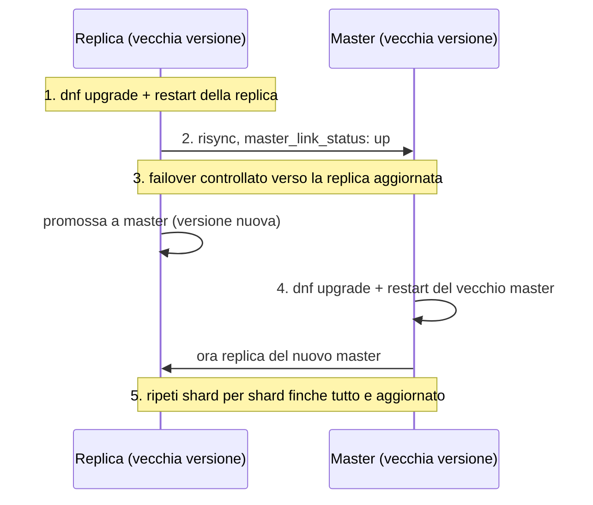
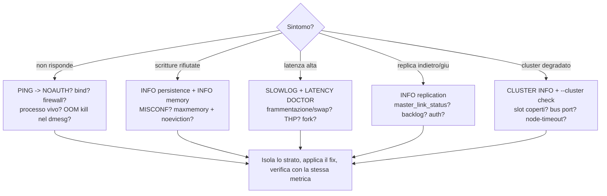

Obiettivo: avere procedure ripetibili di backup/restore e disaster recovery, un
metodo per gli upgrade senza downtime, e un playbook per i problemi più comuni.

---

## 8.1 Backup

Il backup di Redis è, nella pratica, **una copia del file RDB** (più
eventualmente l'AOF). Il punto è ottenere una copia *consistente*.

### Standalone — backup a caldo

```bash
redis-cli BGSAVE
```

Attendi che lo snapshot sia completo confrontando `LASTSAVE` prima/dopo, poi copia
il file:

```bash
redis-cli LASTSAVE
```

```bash
RDB_DIR=$(redis-cli CONFIG GET dir | sed -n 2p); RDB_FILE=$(redis-cli CONFIG GET dbfilename | sed -n 2p); sudo cp "$RDB_DIR/$RDB_FILE" "/backup/dump-$(date +%Y%m%d-%H%M%S).rdb"
```

> L'RDB è uno snapshot **point-in-time**: è perfetto per il backup. L'AOF puoi
> copiarlo per avere le scritture più recenti, ma essendo multi-file (7.x) copia
> l'intera `appendonlydir/`.

### Script di backup automatizzabile (cron)

```bash
sudo tee /usr/local/bin/redis-backup.sh > /dev/null << 'EOF'
#!/usr/bin/env bash
set -euo pipefail
DEST=/backup/redis
RETENTION_DAYS=14
mkdir -p "$DEST"
DIR=$(redis-cli CONFIG GET dir | sed -n 2p)
FILE=$(redis-cli CONFIG GET dbfilename | sed -n 2p)
PRE=$(redis-cli LASTSAVE)
redis-cli BGSAVE >/dev/null
# attendi il completamento del nuovo snapshot
until [ "$(redis-cli LASTSAVE)" -gt "$PRE" ]; do sleep 1; done
cp "$DIR/$FILE" "$DEST/dump-$(date +%Y%m%d-%H%M%S).rdb"
find "$DEST" -name 'dump-*.rdb' -mtime +"$RETENTION_DAYS" -delete
EOF
sudo chmod +x /usr/local/bin/redis-backup.sh
```

```bash
echo '30 2 * * * root /usr/local/bin/redis-backup.sh' | sudo tee /etc/cron.d/redis-backup
```

> In ambienti con auth, lo script deve autenticarsi: usa una variabile
> `REDISCLI_AUTH` (letta automaticamente da `redis-cli`) caricata da un file di
> secret con permessi stretti, **mai** la password in chiaro nel crontab.

### Cluster — backup per nodo

Nel cluster ogni master detiene una porzione di slot: esegui il backup **su
ciascun master** (lo stesso script puntato a ogni porta/host). Per un ripristino
consistente del cluster serve coordinare gli snapshot dei nodi o usare una
finestra a basso traffico.

### Off-host

Una copia su disco locale non è un backup: replica le copie su storage esterno
(object storage, NFS, nastro) e **testa periodicamente il restore**. Un backup
mai ripristinato non è un backup.

---

## 8.2 Restore

A istanza **ferma**:

```bash
sudo systemctl stop redis
```

```bash
DIR=$(redis-cli CONFIG GET dir 2>/dev/null | sed -n 2p || echo /var/lib/redis); sudo cp /backup/redis/dump-XXXXXXXX.rdb /var/lib/redis/dump.rdb && sudo chown redis:redis /var/lib/redis/dump.rdb
```

```bash
sudo systemctl start redis && redis-cli DBSIZE
```

Se l'AOF è abilitato, ricorda che al riavvio Redis caricherebbe l'AOF e
**ignorerebbe** l'RDB. Per ripristinare un RDB con AOF attivo: disabilita
temporaneamente `appendonly no`, avvia (carica l'RDB), poi riabilita a caldo
`CONFIG SET appendonly yes` (genera un nuovo AOF dallo stato appena caricato).

Verifica l'integrità prima di rimettere in servizio:

```bash
redis-check-rdb /var/lib/redis/dump.rdb
```

---

## 8.3 Disaster recovery — strategia

- **RPO** (quanti dati posso perdere): determina la frequenza di backup e la
  scelta di persistenza (RDB ogni N min vs AOF `everysec`).
- **RTO** (quanto tempo per tornare su): determina se ti basta un restore manuale
  o serve una replica/standby già pronta in altro sito.
- Pattern comuni: replica cross-site (DR site con replica read-only pronta a
  essere promossa), oppure restore da backup off-site.
- **Runbook scritto e provato**: chi fa cosa, in che ordine, con quali comandi.
  Le esercitazioni (game day) sono parte del lavoro ops.

---

## 8.4 Upgrade

### Minor (es. 8.6.2 → 8.6.3)

Cambi di patch sono in genere drop-in: aggiorna il pacchetto e riavvia.
Standalone con downtime breve accettabile:

```bash
sudo dnf upgrade -y redis && sudo systemctl restart redis && redis-cli INFO server | grep redis_version
```

Per evitare downtime usa la procedura con replica (sotto).

### Senza downtime (replica + failover)

1. Aggiorna e riavvia la **replica**.
2. Verifica che risincronizzi e sia `master_link_status:up`.
3. Fai un **failover** verso la replica aggiornata (Sentinel:
   `SENTINEL failover mymaster`; Cluster: `CLUSTER FAILOVER` su una replica).
4. Aggiorna il vecchio master (ora replica) e riavvialo.
5. Ripeti per ogni shard.



Il principio: **non aggiornare mai il master "vivo" direttamente**. Aggiorni
sempre prima una replica, sposti il ruolo con un failover controllato, poi
aggiorni l'ex-master. Così c'è sempre un master che serve traffico.

### Major (es. 7.x → 8.x)

- Leggi sempre le **release notes** e le note di migrazione: possono esserci
  comandi deprecati, default cambiati, o passaggi di formato.
- I file **RDB/AOF** sono compatibili in avanti (una versione più nuova legge i
  file di una più vecchia), **non** all'indietro: pianifica il rollback con un
  backup pre-upgrade.
- Nel cluster, fai l'upgrade **rolling** shard per shard (replica → failover →
  master), mantenendo sempre il cluster `ok`.

> Pre-upgrade obbligatorio: **backup**, lettura release notes, test in ambiente
> di collaudo, piano di rollback documentato.

---

## 8.5 Playbook di troubleshooting

Approccio: parti sempre da `redis-cli PING`, `INFO`, log
(`/var/log/redis/redis.log` o `journalctl -u redis`), `LATENCY DOCTOR`,
`MEMORY DOCTOR`, `SLOWLOG GET`.



Le sezioni seguenti dettagliano ciascun ramo.

### Non riesco a connettermi

```bash
redis-cli -h <host> -p 6379 ping
```

Cause e verifiche, in ordine:

- **`bind`** troppo restrittivo → `CONFIG GET bind`.
- **`protected-mode`** che blocca client remoti senza auth → imposta auth e/o
  `bind` corretto.
- **Firewall** (porta 6379, e 16379 nel cluster) → `firewall-cmd --list-all`.
- **Autenticazione** mancante → errore `NOAUTH`; usa `-a`/`REDISCLI_AUTH`.
- **`maxclients`/fd** saturi → `rejected_connections` in `INFO stats`.

### `OOM command not allowed` / memoria piena

`INFO memory`: `used_memory` vicino a `maxmemory` con policy `noeviction` → le
scritture vengono rifiutate.

```bash
redis-cli INFO memory | grep -E 'used_memory_human|maxmemory_human|maxmemory_policy'
```

Azioni: capire perché il dataset è cresciuto (`--bigkeys`), valutare aumento RAM
/ `maxmemory`, abilitare un'eviction policy se è una cache, o ridurre i dati
(TTL, pulizia). Se è un **OOM kill del processo** da parte del kernel (non
l'errore Redis), controlla `dmesg`/`journalctl -k` e i **limiti del cgroup**
(container): allinea `maxmemory` al limite del container con margine per fork e
overhead.

```bash
sudo journalctl -k | grep -i -E 'oom|killed process' | tail
```

### Latenza alta

1. `SLOWLOG GET 20` → comandi lenti (spesso `KEYS`, big key, Lua).
2. `LATENCY DOCTOR` → fork, swap, espirazioni.
3. `INFO memory` → `mem_fragmentation_ratio` < 1.0 = **swap** in corso.
4. THP attivo? (`/sys/kernel/mm/transparent_hugepage/enabled`) → disabilita.
5. `latest_fork_usec` alto → snapshot/rewrite pesanti; rivedi `save`/AOF rewrite.
6. `redis-cli --intrinsic-latency 5` per escludere problemi dell'host.

### Replica non allineata

```bash
redis-cli -p 6380 INFO replication | grep -E 'master_link_status|master_sync_in_progress|master_last_io_seconds_ago'
```

- `master_link_status:down` → rete/auth (`masterauth`), o master irraggiungibile.
- Full resync continui → `repl-backlog-size` troppo piccolo per il volume di
  scritture: aumentalo.

### Cluster in `fail`

```bash
redis-cli -p 7000 CLUSTER INFO | grep cluster_state
```

```bash
redis-cli --cluster check 127.0.0.1:7000
```

- `cluster_state:fail` → slot non coperti (un master e tutte le sue replica giù)
  o nodi che non si vedono.
- Verifica la **bus port** (16379) nel firewall tra tutti i nodi.
- `cluster-node-timeout` troppo basso → failover spurî per latenza di rete.

### `MISCONF` — scritture bloccate

```bash
redis-cli INFO persistence | grep -E 'rdb_last_bgsave_status|aof_last_write_status'
```

Con `stop-writes-on-bgsave-error yes`, un BGSAVE fallito (disco pieno, permessi)
blocca le scritture. Risolvi la causa (spazio `df -h`, permessi sulla `dir`), poi
un nuovo `BGSAVE` riuscito sblocca.

### Frammentazione alta

`mem_fragmentation_ratio` stabilmente > 1.5:

```bash
redis-cli CONFIG SET activedefrag yes
```

Se < 1.0 il problema non è frammentazione ma **swap**: agisci su RAM/swappiness.

---

## 8.6 Comandi diagnostici "primo soccorso"

```bash
redis-cli PING; redis-cli INFO server | grep -E 'redis_version|uptime_in_seconds'; redis-cli INFO clients | grep connected_clients; redis-cli INFO memory | grep -E 'used_memory_human|mem_fragmentation_ratio'; redis-cli INFO stats | grep -E 'instantaneous_ops_per_sec|evicted_keys|rejected_connections'; redis-cli INFO persistence | grep -E 'rdb_last_bgsave_status|aof_last_write_status'; redis-cli INFO replication | grep role
```

```bash
sudo journalctl -u redis --no-pager -n 50
```

---

### Prossimo passo

Vai al modulo [09 — Laboratori pratici](09-lab.md) e mettiti alla prova
end-to-end.
