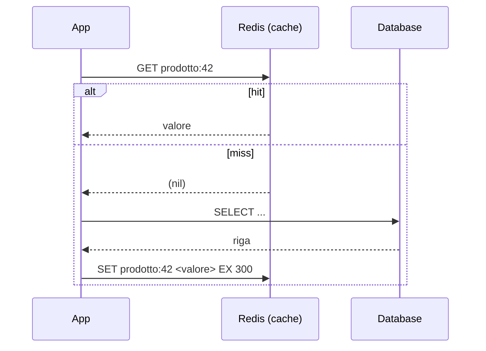
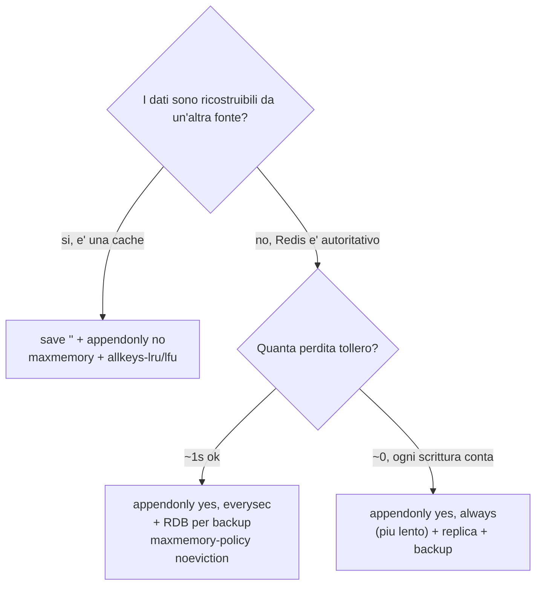

Obiettivo: i pattern con cui Redis viene usato in azienda, ciascuno con le
strutture dati giuste, i comandi, e — soprattutto, dato il taglio del corso — le
**implicazioni operative**: serve persistenza? quale eviction policy? funziona in
cluster? Questo modulo collega l'architettura (mod. 01) alle scelte di config
(mod. 03–07).

Tabella riassuntiva (il dettaglio nei paragrafi):

| Caso d'uso | Struttura | Persistenza | Eviction tipica | Note cluster |
|---|---|---|---|---|
| Cache (cache-aside) | String/Hash | Spesso **no** | `allkeys-lru`/`lfu` | OK, chiavi sparse |
| Session store | Hash/String + TTL | **Sì** (AOF) | `volatile-lru` o `noeviction` | OK |
| Rate limiting | String (contatore) | No | `volatile-*` | OK |
| Lock distribuito | String + TTL | No | `noeviction` consigliato | Attenzione (vedi sotto) |
| Leaderboard / contatori | Sorted Set / String | **Sì** se autoritativo | `noeviction` | OK |
| Coda / job queue | List o **Stream** | **Sì** (AOF) | `noeviction` | OK con hash tag |
| Pub/Sub | canali (non persistiti) | n/a | n/a | usare Sharded Pub/Sub |

---

## 10.1 Cache (cache-aside / lazy loading)

Il pattern più comune: l'app cerca in Redis, se manca (miss) legge dal DB e
ripopola la cache con un TTL.



```bash
redis-cli set prodotto:42 '{"nome":"...","prezzo":9.9}' EX 300
```

**Ops**: è la cache "sacrificabile" per eccellenza. Spesso **senza persistenza**
(`save ""`, `appendonly no`) per massime performance; `maxmemory` + `allkeys-lru`
(o `allkeys-lfu` se hai hot key stabili). Monitora **hit ratio** e `evicted_keys`
(mod. 07): un hit ratio basso significa cache poco efficace o TTL troppo corti.
Attenzione al **cache stampede** (molti miss simultanei sulla stessa chiave alla
scadenza): si mitiga con TTL leggermente randomizzati o un lock di ripopolamento.

---

## 10.2 Session store

Sessioni utente (token → dati di sessione), con scadenza automatica.

```bash
redis-cli HSET session:abc123 user_id 42 role admin
```

```bash
redis-cli EXPIRE session:abc123 1800
```

**Ops**: a differenza della cache, perdere le sessioni significa sloggare tutti
gli utenti → di solito **persistenza attiva** (AOF `everysec`) e `maxmemory-policy`
`noeviction` oppure `volatile-lru` (per evincere solo sessioni con TTL, mai dati
senza scadenza). HA quasi sempre necessaria (replica + Sentinel o cluster).

---

## 10.3 Rate limiting

Limitare richieste per utente/IP in una finestra temporale. La versione "fixed
window" usa un contatore con TTL. L'incremento e l'impostazione del TTL devono
essere **atomici**: si fanno in un solo `EVAL` Lua (eseguito atomicamente
dall'event loop).

```bash
redis-cli EVAL "if redis.call('incr',KEYS[1])==1 then redis.call('expire',KEYS[1],ARGV[1]) end return redis.call('get',KEYS[1])" 1 rate:user:42 60
```

Logica: al primo accesso il contatore vale 1 e si imposta il TTL della finestra;
gli accessi successivi incrementano; l'app confronta il valore restituito con il
limite. Per finestre scorrevoli più precise si usa un Sorted Set con timestamp.

**Ops**: chiavi piccole e a vita breve; nessuna persistenza necessaria. La
politica `volatile-*` va bene. In cluster ogni chiave `rate:*` è indipendente:
nessun problema di sharding.

---

## 10.4 Lock distribuito

Mutua esclusione tra processi su una risorsa condivisa. Acquisizione con
`SET key token NX PX <ttl>` (atomico: crea solo se assente e con scadenza), e
rilascio **sicuro** che cancella solo se il token combacia (per non rilasciare un
lock di un altro), via Lua.

```bash
redis-cli SET lock:risorsa "$(uuidgen)" NX PX 10000
```

Rilascio sicuro (sostituisci `<token>` con quello ottenuto):

```bash
redis-cli EVAL "if redis.call('get',KEYS[1])==ARGV[1] then return redis.call('del',KEYS[1]) else return 0 end" 1 lock:risorsa "<token>"
```

> **Avvertenza enterprise.** Un lock su una singola istanza Redis **non** è un lock
> di consenso: in un failover (la replica è asincrona) il lock può "sparire" e due
> client possono crederlo proprio contemporaneamente. L'algoritmo **Redlock** (su
> N istanze indipendenti) riduce il rischio ma è dibattuto e **non** garantisce
> correttezza sotto tutte le assunzioni di rete/clock. Regola pratica: usa i lock
> Redis per *efficienza* (evitare lavoro duplicato), non per *correttezza* su
> risorse dove una doppia esecuzione causa danni. Per la correttezza forte servono
> sistemi di consenso (es. fencing token + storage transazionale). Il TTL del lock
> è obbligatorio: protegge dal client che muore tenendo il lock.

---

## 10.5 Leaderboard, contatori, analytics

Classifiche e ranking in tempo reale con Sorted Set; contatori con `INCR`;
conteggi unici approssimati con HyperLogLog.

```bash
redis-cli ZADD classifica 250 bob 175 cleo 100 ada
```

```bash
redis-cli ZREVRANGE classifica 0 9 WITHSCORES
```

Contatore atomico e conteggio unici approssimato:

```bash
redis-cli INCR pageviews:2026-06-11
```

```bash
redis-cli PFADD visitatori:2026-06-11 user42 user7 user42 && redis-cli PFCOUNT visitatori:2026-06-11
```

**Ops**: se la classifica è la fonte autoritativa del dato, serve **persistenza**;
se è ricostruibile da un DB, può essere cache. Attenzione ai **big key**: un
Sorted Set con milioni di membri è un big key (latenza su operazioni O(N) come
`ZRANGE` ampi); usa range limitati e `ZSCAN`.

---

## 10.6 Coda di lavoro / job queue

Due approcci:

- **List** (semplice): produttore `LPUSH`, consumatore `BRPOP` (bloccante).
  Semplice ma senza ack: se il worker muore dopo il pop, il job è perso.
- **Stream** (robusto, consigliato in enterprise): append-only con **consumer
  group**, ack espliciti e ri-consegna dei messaggi non confermati.

Stream con consumer group:

```bash
redis-cli XADD eventi '*' tipo ordine id 1001
```

```bash
redis-cli XGROUP CREATE eventi workers '$' MKSTREAM
```

```bash
redis-cli XREADGROUP GROUP workers worker1 COUNT 10 STREAMS eventi '>'
```

```bash
redis-cli XACK eventi workers <id-messaggio>
```

I messaggi letti ma non ancora `XACK`-ati restano nella **PEL** (Pending Entries
List) e sono visibili con `XPENDING`; un worker può rivendicare i messaggi
"orfani" di un consumer morto con `XAUTOCLAIM`.

```bash
redis-cli XPENDING eventi workers
```

**Ops**: una coda è dati di lavoro che non vuoi perdere → **AOF `everysec`** (o
`always` se ogni job è critico) e `noeviction` (non vuoi che la coda venga
evinta!). Limita la crescita dello Stream con `XADD ... MAXLEN ~ N` o `XTRIM`.
In cluster, se devi tenere insieme stream correlati usa **hash tag** per
co-localizzarli sullo stesso slot.

---

## 10.7 Pub/Sub e messaggistica

Pub/Sub classico recapita ai subscriber connessi *al momento* (nessuna
persistenza, "fire and forget"):

```bash
redis-cli SUBSCRIBE canale:notifiche
```

```bash
redis-cli PUBLISH canale:notifiche "messaggio"
```

**Ops**: il Pub/Sub classico **non** è una coda durabile (i messaggi non vengono
salvati né riconsegnati). Per messaggistica affidabile usa gli **Stream** (10.6).
In **Redis Cluster** il Pub/Sub classico propaga su tutti i nodi via bus
(costoso); preferisci lo **Sharded Pub/Sub** (`SSUBSCRIBE`/`SPUBLISH`), che limita
la propagazione allo shard dello slot del canale.

---

## 10.8 Scegliere persistenza ed eviction in base al caso

Albero decisionale operativo:



---

## 10.9 Mini-lab dei casi d'uso

Esegui su un'istanza locale (`redis-server --port 7000 --dir ~/redis-lab
--daemonize yes`). Sono indipendenti.

```bash
# Rate limiter: lancia 3 richieste, osserva il contatore e il TTL
for i in 1 2 3; do redis-cli -p 7000 EVAL "if redis.call('incr',KEYS[1])==1 then redis.call('expire',KEYS[1],ARGV[1]) end return redis.call('get',KEYS[1])" 1 rate:demo 60; done; redis-cli -p 7000 TTL rate:demo
```

```bash
# Lock: acquisisci, riprova (nil), rilascia in modo sicuro
T=$(uuidgen); redis-cli -p 7000 SET lock:demo "$T" NX PX 10000; redis-cli -p 7000 SET lock:demo "x" NX PX 10000; redis-cli -p 7000 EVAL "if redis.call('get',KEYS[1])==ARGV[1] then return redis.call('del',KEYS[1]) else return 0 end" 1 lock:demo "$T"
```

```bash
# Stream + consumer group: produci, leggi come gruppo, verifica pending, ack
redis-cli -p 7000 XADD q '*' job a >/dev/null; redis-cli -p 7000 XGROUP CREATE q g 0 2>/dev/null; ID=$(redis-cli -p 7000 XREADGROUP GROUP g w1 COUNT 1 STREAMS q '>' | sed -n '3p'); echo "letto id=$ID"; redis-cli -p 7000 XPENDING q g; redis-cli -p 7000 XACK q g "$ID"; redis-cli -p 7000 XPENDING q g
```

**Domande**
1. Perché l'incremento + expire del rate limiter va fatto in un solo `EVAL`?
2. In quali casi una `List` come coda è inaccettabile e servono gli Stream?
3. Quale eviction policy useresti per un'istanza che fa **sia** cache **sia**
   session store, e perché?

---

### Prossimo passo

Modulo [11 — Produzione enterprise e go-live](11-produzione-enterprise.md).
