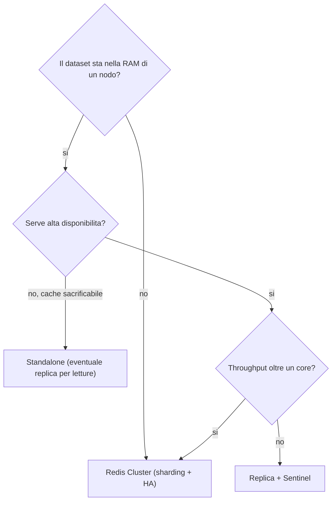
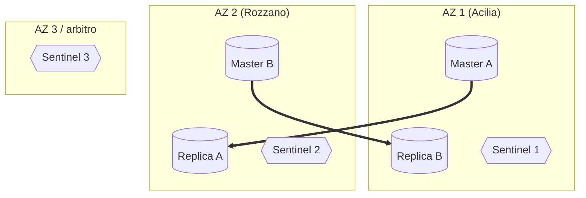

Obiettivo: portare Redis da "funziona sul mio host" a un servizio di piattaforma
*enterprise ready*: dimensionato, in HA, sicuro, osservabile, manutenibile e con
procedure di ripristino provate. È il modulo che useresti come checklist prima di
mettere Redis sotto carico produttivo in un contesto regolamentato (es. banking).

---

## 11.1 Capacity planning e sizing

Il sizing parte dalla RAM, perché il dataset deve starci tutto (mod. 01).

**RAM.** Stima il dataset reale e aggiungi margine:

- Dataset misurato (`used_memory`) **+ ~25–30%** di overhead per frammentazione e
  strutture interne.
- **+ margine per il fork (COW)**: durante BGSAVE/rewrite, in scenari write-heavy
  può servire fino al dataset di RAM aggiuntiva nei casi estremi. Regola pratica
  conservativa: dimensiona l'host in modo che il dataset occupi **≤ 50–60%** della
  RAM totale.
- Imposta sempre **`maxmemory`** sotto la RAM dell'host/cgroup, lasciando spazio a
  buffer di replica, output client e fork.

**CPU.** L'event loop è single-thread: conta la **frequenza** di un core, non il
numero di core. Riserva core per: I/O threads (se attivi), processi figli del
fork, e l'OS. Una VM con 2–4 vCPU è tipica per istanza standalone; scala in
orizzontale (cluster) per più throughput, non aggiungendo vCPU.

**Rete.** La replica e gli snapshot diskless saturano banda. In cluster, il bus di
gossip aggiunge traffico. Su workload ad alto throughput la NIC può diventare il
collo di bottiglia prima della CPU.

**Disco.** Solo per persistenza/replica, ma deve reggere il fsync dell'AOF e la
scrittura degli RDB senza latenza. SSD/NVMe consigliati; evita storage di rete
lento per la `dir`.

> Calibra sempre con un **baseline `redis-benchmark`** (mod. 07) sull'hardware
> reale e con dati rappresentativi, non su numeri teorici.

---

## 11.2 Scegliere la topologia

| Topologia | Quando | HA | Scaling | Complessità |
|---|---|---|---|---|
| Standalone | Cache non critica, dev/test | No | Letture via replica | Bassa |
| Replica + Sentinel | Dataset in un nodo, serve HA | Sì (failover) | Letture | Media |
| Cluster | Dataset grande o alto throughput | Sì (interno) | Scrittura+lettura | Alta |

### Distribuzione multi-AZ / multi-sito

L'HA è reale solo se i nodi sono su **domini di guasto diversi**. Per Sentinel:
master, replica e i 3 Sentinel su AZ/host distinti. Per Cluster: master e relativa
replica **mai sullo stesso host/AZ**.

> Per il **disaster recovery** cross-sito si tiene spesso una replica nel sito DR
> pronta a essere promossa (RTO basso) oppure si fa restore da backup off-site
> (RTO più alto, infra minore). La scelta dipende dai target RPO/RTO concordati.

---

## 11.3 Obiettivi di disponibilità: RPO e RTO

Concorda e documenta due numeri, perché guidano tutte le scelte:

- **RPO** (Recovery Point Objective): quanti dati puoi perdere. Guida la
  persistenza (AOF `everysec` ≈ ~1s; `always` ≈ ~0) e la frequenza di backup.
- **RTO** (Recovery Time Objective): in quanto tempo torni operativo. Guida la
  topologia (replica calda vs restore da backup) e il grado di automazione.

Ricorda il limite intrinseco: la replica è **asincrona**, quindi anche con HA c'è
una finestra di perdita possibile in un failover (mod. 05). Non promettere RPO=0
con la sola replica Redis.

---

## 11.4 Sicurezza e governance (enterprise)

Oltre all'hardening di base (mod. 03), in un contesto enterprise/regolamentato:

- **Autenticazione e autorizzazione**: ACL per **ruolo/servizio**, principio del
  minimo privilegio, utente `default` disabilitato, nessun account condiviso. Gli
  ACL versionati (aclfile in git/secret store) e rivisti periodicamente.
- **Segregazione di rete**: Redis su VLAN/subnet dedicate, raggiungibile solo dai
  servizi autorizzati; firewall esplicito per porta client e bus (cluster). Mai
  esposto su reti non fidate.
- **Cifratura**: **TLS** per il traffico che esce dall'host; **mTLS** dove la
  policy richiede autenticazione reciproca (cert client). TLS anche per
  replica/cluster (`tls-replication`, `tls-cluster`).
- **Gestione dei segreti**: password e chiavi private in un **secret manager**
  (Vault, secret di piattaforma), mai in chiaro in config versionate o variabili
  d'ambiente di processo. Rotazione periodica.
- **Audit e logging**: log centralizzati (forwarding verso il SIEM), tracciamento
  degli accessi amministrativi, conservazione secondo policy. Valuta `ACL LOG`
  per gli accessi negati.
- **Comandi pericolosi**: rimossi via ACL ai servizi (`-@dangerous`, `-flushall`,
  `-config`, `-debug`); riservati a un utente admin usato solo per manutenzione.
- **Compliance e licenza**: verifica con legal/security la licenza accettabile
  (AGPLv3 vs RSAL per Redis 8.x, BSD per Valkey) e le implicazioni per software
  embedded o offerto come servizio (mod. 02).
- **Supply chain**: pacchetti firmati da fonte verificata (mirror interno o repo
  ufficiale), verifica delle firme GPG, gestione delle CVE con un processo di
  patching definito.

---

## 11.5 Osservabilità e SLO

Costruisci sull'infrastruttura del mod. 07 (`redis_exporter` → Prometheus →
Grafana/Alertmanager) e definisci **SLI/SLO** espliciti.

SLI tipici per un servizio Redis:

| SLI | Come si misura | Esempio SLO |
|---|---|---|
| Disponibilità | `redis_up` / health check | 99.95% mensile |
| Latenza | p99 lato client + `LATENCY` server | p99 < 5 ms |
| Hit ratio (cache) | hits/(hits+misses) | > 90% |
| Saturazione memoria | used/maxmemory | < 80% sostenuto |
| Errori | rejected/refused/evicted in crescita | ~0 |

Allerta su ciò che richiede azione (mod. 07): istanza giù, link replica giù,
memoria > soglia con evictions, snapshot/AOF falliti, frammentazione/swap,
rejected connections. Evita alert rumorosi che nessuno guarda.

---

## 11.6 Manutenzione e patching

- **Finestre di cambio** concordate; ogni intervento ha rollback documentato.
- **Patching delle CVE**: processo definito, priorità per le vulnerabilità con RCE
  (Redis è spesso esposto in reti interne con auth minima — una CVE non patchata
  diventa un vettore reale; mod. 02).
- **Upgrade senza downtime** con la procedura replica → failover → master, shard
  per shard nel cluster (mod. 08). Mai aggiornare il master vivo direttamente.
- **Backup pre-intervento** sempre, con restore già provato.
- **Drill periodici** (game day): failover, restore, perdita di un'AZ. Una
  procedura mai eseguita non è una procedura.

---

## 11.7 Runbook di disaster recovery (scheletro)

Tieni nel repo del team un runbook con, per ogni scenario, comandi e verifiche:

1. **Perdita del master (Sentinel)**: verifica promozione automatica
   (`SENTINEL get-master-addr-by-name`), riaggancio del vecchio master come
   replica, controllo lag.
2. **Perdita di un nodo cluster**: verifica `cluster_state:ok` e copertura slot,
   eventuale `--cluster fix`, reintegro del nodo.
3. **Corruzione dati / restore**: stop istanza, ripristino RDB/AOF da backup
   off-site, `redis-check-rdb`/`redis-check-aof`, verifica `DBSIZE` e campioni.
4. **Perdita di un'intera AZ/sito**: promozione della replica nel sito DR,
   ridirezione dei client, ricostruzione della ridondanza.
5. **MISCONF / scritture bloccate**: diagnosi `rdb_last_bgsave_status`, libera
   disco/permessi, BGSAVE di verifica (mod. 08).

Ogni voce: prerequisiti, comandi, output atteso, criterio di "risolto", chi
contattare.

---

## 11.8 Checklist di produzione (go-live gate)

Da spuntare prima di esporre l'istanza al carico reale.

**Architettura e capacity**
- [ ] Topologia scelta e giustificata (standalone / Sentinel / cluster).
- [ ] Dataset stimato ≤ 50–60% della RAM; `maxmemory` impostato sotto RAM/cgroup.
- [ ] Nodi su AZ/host diversi (per HA); Sentinel dispari (≥3).
- [ ] Baseline `redis-benchmark` su hardware reale registrato.

**Persistenza e backup**
- [ ] Persistenza coerente col caso d'uso (cache: off; datastore: AOF `everysec`).
- [ ] Backup automatizzato con rotazione e copia **off-site**.
- [ ] Restore **provato** end-to-end (non solo configurato).

**Sicurezza**
- [ ] `protected-mode yes`, `bind` su IP interni, firewall (client + bus).
- [ ] ACL per ruolo, `default` disabilitato, comandi pericolosi rimossi ai servizi.
- [ ] TLS/mTLS attivo sul traffico esterno all'host.
- [ ] Segreti in secret manager; nessuna password in chiaro versionata.
- [ ] Licenza/compliance verificata con security/legal.

**Tuning OS**
- [ ] `vm.overcommit_memory=1`, THP disabilitato, `swappiness` basso.
- [ ] `somaxconn`/`tcp-backlog` allineati; `LimitNOFILE` adeguato a `maxclients`.

**Osservabilità**
- [ ] Exporter + Prometheus + dashboard attivi; alert sui segnali d'azione.
- [ ] SLI/SLO definiti e monitorati.
- [ ] Log centralizzati verso SIEM.

**Operatività**
- [ ] Runbook DR scritto e i comandi testati.
- [ ] Procedura di upgrade rolling documentata.
- [ ] Game day di failover/restore pianificato.

---

## 11.9 Anti-pattern da evitare

- Esporre Redis senza auth/`bind`/firewall (compromissione quasi garantita).
- Nessun `maxmemory` su un datastore che cresce → OOM kill (mod. 01/08).
- `KEYS *`, `FLUSHALL`, big key con operazioni O(N) in produzione → blocco
  dell'event loop (mod. 01).
- Usare i DB numerici (`SELECT 1..15`) per isolare ambienti: usa istanze separate
  o prefissi; in cluster esiste solo il DB 0.
- Lock Redis usati per *correttezza* su risorse critiche senza fencing (10.4).
- Affidarsi al Pub/Sub classico come coda durabile: usa gli Stream (10.6/10.7).
- "HA" con tutti i nodi sullo stesso host/AZ: non è ridondanza.
- Backup mai ripristinato, runbook mai eseguito.

---

### Fine del percorso enterprise

Con i moduli 01–11 e i lab del modulo 09 hai un percorso completo: fondamenti,
installazione standalone e cluster, configurazione, sicurezza, persistenza, HA,
scaling, casi d'uso, osservabilità e operatività enterprise. Consulta la
[guida al repository e al deploy su Cloudflare Pages](deploy.md) per pubblicare
il corso come sito di documentazione.
