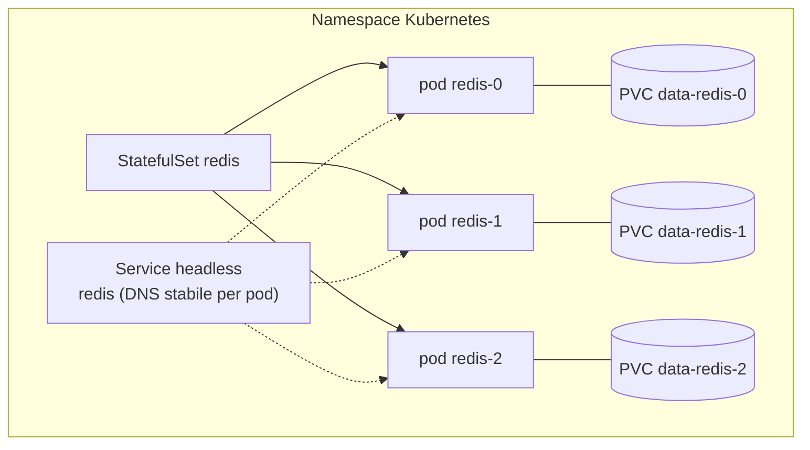
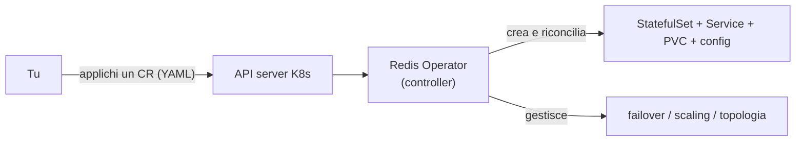

> **Nota sulla validazione.** A differenza dei laboratori del modulo 09 (eseguiti
> su Redis reale), i contenuti di questo modulo si basano sulla documentazione
> ufficiale e sono aggiornati a metà 2026: **vanno verificati sul tuo cluster** e
> sulle versioni di operator/chart correnti. I manifest sono esempi minimi
> didattici, non configurazioni di produzione pronte all'uso.

## 12.1 Perché Redis su K8s è diverso

Kubernetes nasce per carichi **stateless**. Redis è **stateful**: ha dati in
memoria da persistere, identità di rete stabili (chi è il master?) e topologie
(replica, cluster) da coordinare. Questo impone tre cose:

- **`StatefulSet`** invece di `Deployment`: dà ai pod nomi e identità stabili
  (`redis-0`, `redis-1`, …) e un volume dedicato per ciascuno.
- **Storage persistente** via **PVC** (PersistentVolumeClaim): i dati RDB/AOF
  devono sopravvivere al riavvio del pod.
- **Coordinamento di HA**: configurare replica, Sentinel o cluster a mano sui pod
  è complesso e fragile → per questo si usano gli **Operator**.



## 12.2 Le opzioni, in sintesi

| Approccio | Cosa ottieni | Quando |
|---|---|---|
| **StatefulSet a mano** | Una o poche istanze, controllo totale dei manifest | Capire come funziona; casi semplici/single-node |
| **Operator OSS** (opstree, spotahome) | Standalone/replica/cluster/sentinel gestiti da CRD | Self-managed open source su K8s/OpenShift |
| **Redis Enterprise Operator** | Cluster Enterprise (REC/REDB), supporto commerciale | Hai licenza Redis Enterprise; OperatorHub OpenShift |
| **Helm chart (Valkey)** | Install rapida via chart | Deploy semplice, ecosistema open source |

> **Attenzione alla storica chart `bitnami/redis`.** Dopo la riorganizzazione del
> catalogo Bitnami (fine 2025) le immagini versionate sono state spostate in un
> repository *legacy* non più aggiornato. Non è più la scelta "di default" sicura:
> preferisci un **Operator OSS** o la **chart Valkey** open source, oppure
> immagini che mantieni tu in un registry interno.

## 12.3 Opzione A — StatefulSet minimo (per capire)

Una singola istanza Redis con persistenza, utile per imparare. In produzione
useresti un operator (12.4). I tre oggetti: una `ConfigMap` con `redis.conf`, un
`Service` headless, uno `StatefulSet` con `volumeClaimTemplates`.

```yaml
apiVersion: v1
kind: ConfigMap
metadata:
  name: redis-config
data:
  redis.conf: |
    appendonly yes
    dir /data
    maxmemory 256mb
    maxmemory-policy noeviction
---
apiVersion: v1
kind: Service
metadata:
  name: redis
spec:
  clusterIP: None          # headless: DNS stabile per ogni pod
  selector:
    app: redis
  ports:
    - port: 6379
      name: redis
---
apiVersion: apps/v1
kind: StatefulSet
metadata:
  name: redis
spec:
  serviceName: redis
  replicas: 1
  selector:
    matchLabels:
      app: redis
  template:
    metadata:
      labels:
        app: redis
    spec:
      containers:
        - name: redis
          image: redis:8-alpine
          args: ["/etc/redis/redis.conf"]
          ports:
            - containerPort: 6379
          volumeMounts:
            - name: data
              mountPath: /data
            - name: config
              mountPath: /etc/redis
          livenessProbe:
            tcpSocket: { port: 6379 }
            initialDelaySeconds: 15
          readinessProbe:
            exec: { command: ["redis-cli", "ping"] }
            initialDelaySeconds: 5
      volumes:
        - name: config
          configMap:
            name: redis-config
  volumeClaimTemplates:
    - metadata:
        name: data
      spec:
        accessModes: ["ReadWriteOnce"]
        resources:
          requests:
            storage: 5Gi
```

```bash
kubectl apply -f redis-statefulset.yaml
```

```bash
kubectl exec -it redis-0 -- redis-cli ping
```

Limite: replica, failover e cluster restano da gestire a mano. È esattamente il
problema che gli operator risolvono.

## 12.4 Opzione B — Operator OSS

Un **Operator** estende Kubernetes con risorse personalizzate (CRD): dichiari lo
stato desiderato (es. "Redis in replica, 1 master + 2 replica") e il controller lo
realizza e lo mantiene (failover, riconciliazione, scaling).



Due operator OSS diffusi:

- **opstree / OT-CONTAINER-KIT `redis-operator`**: copre standalone, replication,
  cluster e sentinel. Repo Helm `https://ot-container-kit.github.io/helm-charts`.
- **spotahome `redis-operator`**: HA con Sentinel e failover automatico, CRD
  `RedisFailover`. Repo Helm `https://spotahome.github.io/redis-operator`.

Esempio con spotahome (installa l'operator, poi crea un `RedisFailover`):

```bash
helm repo add redis-operator https://spotahome.github.io/redis-operator && helm repo update
```

```bash
helm install redis-operator redis-operator/redis-operator
```

```yaml
apiVersion: databases.spotahome.com/v1
kind: RedisFailover
metadata:
  name: redisfailover
spec:
  sentinel:
    replicas: 3
  redis:
    replicas: 3
    storage:
      persistentVolumeClaim:
        metadata:
          name: redisfailover-data
        spec:
          accessModes: ["ReadWriteOnce"]
          resources:
            requests:
              storage: 5Gi
```

```bash
kubectl apply -f redisfailover.yaml
```

L'operator crea 1 master + 2 replica più 3 Sentinel e ne gestisce il failover:
sono gli stessi concetti del [modulo 05](05-replica-sentinel.md), ma orchestrati.

## 12.5 Opzione C — Redis Enterprise Operator

È l'operator **ufficiale commerciale** per chi ha licenza Redis Enterprise.
Introduce due CRD principali: **REC** (`RedisEnterpriseCluster`, il cluster) e
**REDB** (`RedisEnterpriseDatabase`, i database sopra il cluster). Si installa via
Helm (`helm repo add redis https://helm.redis.io`) o, su OpenShift, **da
OperatorHub**. Richiede tipicamente **almeno 3 worker node**. È la strada quando
servono funzioni Enterprise (Active-Active, scaling gestito, supporto).

## 12.6 Persistenza e HA su Kubernetes

- **Persistenza**: i dati vivono nei **PVC** (uno per pod via
  `volumeClaimTemplates`). Scegli una `storageClass` con prestazioni adeguate
  all'fsync dell'AOF (modulo 04). Il PVC sopravvive al riavvio del pod, non
  necessariamente alla cancellazione del PVC stesso.
- **Spalmare i pod** su nodi/zone diverse con `podAntiAffinity` (l'equivalente K8s
  della regola "master e replica mai sullo stesso host" del modulo 05/06).
- **`PodDisruptionBudget`** per evitare che drain/upgrade del cluster spengano
  troppe istanze insieme.
- **Probe**: `readinessProbe` con `redis-cli ping` evita di mandare traffico a un
  pod non pronto; la `livenessProbe` riavvia un pod bloccato.

```yaml
affinity:
  podAntiAffinity:
    preferredDuringSchedulingIgnoredDuringExecution:
      - weight: 100
        podAffinityTerm:
          labelSelector:
            matchLabels:
              app: redis
          topologyKey: kubernetes.io/hostname
```

## 12.7 Note specifiche OpenShift

Su OpenShift valgono alcune differenze pratiche (utili per chi lavora su OCP):

- **Installazione operator**: dalla console web → **OperatorHub** (OLM) installi
  l'operator nel namespace; OLM ne gestisce gli upgrade. È il modo idiomatico su
  OCP rispetto all'`helm install` manuale.
- **Security Context Constraints (SCC)**: OpenShift di default assegna ai pod uno
  **UID arbitrario** (SCC `restricted-v2`). Usa immagini che non pretendono di
  girare come `root` o come un UID fisso (le immagini Redis ufficiali e gli
  operator pensati per OCP lo supportano); evita di forzare `runAsUser` non
  consentiti. Se un'immagine richiede un UID specifico, serve una SCC dedicata
  (valutala con il team di piattaforma).
- **Storage**: usa una `storageClass` CSI supportata dal cluster (es. su vSphere
  la relativa CSI); verifica `ReadWriteOnce` e prestazioni per l'AOF.
- **Accesso**: per l'uso interno cluster basta il `Service`; esponi all'esterno
  solo se necessario e con attenzione (Redis non va esposto su reti non fidate —
  modulo 03). Per il traffico TCP non-HTTP valuta un Service `LoadBalancer` o le
  funzionalità di ingress TCP del cluster, non una semplice Route HTTP.

## 12.8 Quando NON mettere Redis su K8s

- Se hai già a disposizione un **managed cloud** (modulo 00) e non hai requisiti
  che impongano il self-hosting: spesso è più semplice e affidabile.
- Se ti serve **una sola istanza** stabile e non hai una piattaforma K8s matura:
  una VM con systemd (moduli 02–05) può essere più semplice da operare.
- Se il team non ha confidenza con storage/operator su K8s: lo stateful su
  Kubernetes aggiunge superfici di guasto (storage, scheduling, upgrade del
  cluster) che vanno padroneggiate.

La regola: Kubernetes per Redis conviene quando **hai già** la piattaforma e
vuoi gestire molte istanze in modo dichiarativo e ripetibile, idealmente con un
operator che incapsula le pratiche dei moduli 05–06.

---

### Fine del percorso

Hai completato il corso: dai fondamenti (00–01) all'operatività enterprise (11)
fino all'orchestrazione su Kubernetes/OpenShift (12). Per pubblicare questi
materiali come sito, vedi la [guida al deploy](deploy.md).
