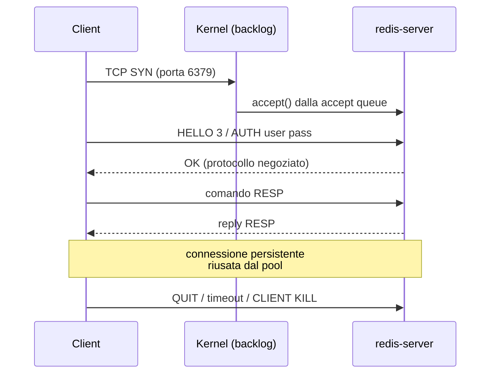
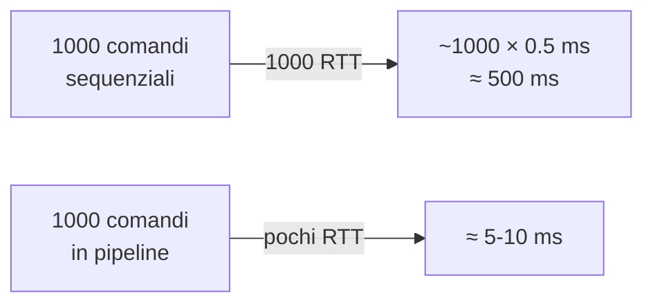

Obiettivo: governare il **lato connessione** di Redis — il confine dove il tuo
perimetro infrastrutturale incontra le applicazioni. Qui si concentrano la
maggior parte degli incidenti "Redis è lento" che in realtà sono problemi di
client, pool o file descriptor.

:::note[Perimetro]
Il codice del client non è tuo. Ma i limiti server-side, i file descriptor, il
backlog TCP e la diagnosi di chi sta saturando le connessioni **sì**. Questo
modulo ti dà anche le domande precise da girare agli AM.
:::

---

## 13.1 Ciclo di vita di una connessione



Punti che contano in operations:

| Fase | Limite coinvolto | Sintomo se saturo |
|---|---|---|
| SYN → accept queue | `tcp-backlog`, `net.core.somaxconn` | connessioni lente/perse sotto burst |
| `accept()` | `maxclients`, `ulimit -n` | `ERR max number of clients reached` |
| autenticazione | ACL, `requirepass` | `NOAUTH` / `WRONGPASS` nei log app |
| comando | single thread, `slowlog` | latenza a coda lunga |
| chiusura | `timeout`, `tcp-keepalive` | connessioni zombie, FD esauriti |

---

## 13.2 RESP2 e RESP3

Redis parla il protocollo RESP. Dalla 6.0 esiste **RESP3**, negoziato dal client
con `HELLO 3`.

```bash
redis-cli -3 HELLO 3            # negozia RESP3 esplicitamente
redis-cli CLIENT INFO           # campo resp=2|3
```

Cosa cambia per te:

- RESP3 introduce i **push message**, prerequisito per il client-side caching
  (§13.7) e per il pub/sub sulla stessa connessione.
- Tipi di risposta nativi (map, set, double): alcuni comandi rispondono in forma
  diversa. Un upgrade di client library che passa a RESP3 di default può
  cambiare il parsing lato applicativo → **da tracciare nei change**.
- `redis-cli` senza `-3` resta RESP2: se confronti un output con quello di un
  client applicativo, verifica prima il campo `resp`.

---

## 13.3 Limiti server-side: `maxclients` e file descriptor

`maxclients` non è mai autonomo: Redis lo **abbassa silenziosamente** se il
limite di file descriptor del processo non lo regge (servono `maxclients` + ~32
FD riservati).

```bash
redis-cli CONFIG GET maxclients
redis-cli INFO clients | grep -E 'connected_clients|maxclients|blocked'
redis-cli INFO stats  | grep rejected_connections   # >0 = hai già sforato
```

Verifica il limite reale del processo, non quello della shell:

```bash
pid=$(pgrep -o redis-server); cat /proc/$pid/limits | grep 'open files'
ls /proc/$pid/fd | wc -l
```

Alzare il limite in modo persistente (systemd, RHEL 8/9):

```bash
sudo systemctl edit redis
# [Service]
# LimitNOFILE=65535
sudo systemctl daemon-reload && sudo systemctl restart redis
```

```bash
redis-cli CONFIG SET maxclients 20000        # runtime
sudo sed -i 's/^# *maxclients .*/maxclients 20000/' /etc/redis/redis.conf   # persistente
```

:::caution
Se `maxclients` risulta più basso di quanto configurato, il log di avvio lo dice
esplicitamente. Controlla sempre lì dopo un cambio: `journalctl -u redis | grep -i maxclients`
:::

Backlog di accept (burst di riconnessioni, tipico dopo un failover):

```bash
sysctl net.core.somaxconn net.ipv4.tcp_max_syn_backlog
echo 'net.core.somaxconn = 1024' | sudo tee /etc/sysctl.d/99-redis.conf
sudo sysctl --system
redis-cli CONFIG SET tcp-backlog 1024        # richiede restart per avere effetto pieno
```

---

## 13.4 Timeout e keepalive

| Parametro | Dove | Effetto |
|---|---|---|
| `timeout` | redis.conf | chiude connessioni **idle** dopo N secondi (0 = mai) |
| `tcp-keepalive` | redis.conf | invia ACK keepalive ogni N secondi (default 300) |

Regola pratica: `tcp-keepalive 300` sempre attivo (rileva peer morti dietro
firewall che droppano silenziosamente), `timeout 0` se i client usano pool
persistenti — un `timeout` aggressivo contro un pool provoca errori di
connessione "a freddo" sul primo utilizzo.

```bash
redis-cli CONFIG GET timeout tcp-keepalive
```

:::tip[Firewall in mezzo]
Molti firewall enterprise droppano le sessioni idle a 15–30 min senza RST. Se
vedi errori di connessione periodici e regolari, confronta il timer del firewall
con `tcp-keepalive`: il keepalive deve essere **più corto**.
:::

---

## 13.5 Ispezionare e controllare i client

```bash
redis-cli CLIENT LIST                        # tutte le connessioni
redis-cli CLIENT INFO                        # solo la propria
redis-cli CLIENT LIST TYPE replica           # normal | master | replica | pubsub
redis-cli CLIENT NO-EVICT on                 # esclude il client dall'eviction del buffer
redis-cli CLIENT NO-TOUCH on                 # non aggiorna LRU/LFU (utile a un tool di ops)
```

Campi di `CLIENT LIST` che leggi davvero:

| Campo | Significato operativo |
|---|---|
| `addr` | IP:porta sorgente → identifica il pod/servizio |
| `age` | secondi dalla connessione (pool sano = valori alti e stabili) |
| `idle` | secondi dall'ultimo comando |
| `cmd` | ultimo comando eseguito |
| `qbuf` / `omem` | buffer input/output: `omem` alto = client lento o `KEYS` massivo |
| `sub` / `psub` | sottoscrizioni pub/sub |
| `resp` | versione protocollo |
| `lib-name` / `lib-ver` | libreria client (se il client fa `CLIENT SETINFO`) |

Chi sono i primi consumatori di connessioni:

```bash
redis-cli CLIENT LIST | awk '{for(i=1;i<=NF;i++) if($i ~ /^addr=/){split($i,a,"="); split(a[2],b,":"); print b[1]}}' | sort | uniq -c | sort -rn | head
```

Chiusura mirata (usa `LADDR`/`ADDR`/`ID`, mai a caso in produzione):

```bash
redis-cli CLIENT KILL ID 42
redis-cli CLIENT KILL ADDR 10.20.30.40:51234
redis-cli CLIENT KILL TYPE normal SKIPME yes    # emergenza: chiude tutti i client applicativi
```

Freeze controllato per manutenzione (blocca i comandi senza chiudere le
connessioni — utile prima di un failover manuale):

```bash
redis-cli CLIENT PAUSE 5000 WRITE     # ms; WRITE = solo scritture, ALL = tutto
redis-cli CLIENT UNPAUSE
```

---

## 13.6 Connection pool: cosa esigere dalle applicazioni

Il pool sta lato client, ma il suo dimensionamento sbagliato ti arriva addosso
come saturazione di `maxclients`.

Stima grezza del fabbisogno:

```
connessioni totali ≈ n. istanze applicative × pool size massimo (+ pool separati per pub/sub e blocking)
```

Domande da mettere nel change/handover:

- Pool size **massimo** per istanza e numero di repliche previste in scale-out.
- Connessione dedicata per `SUBSCRIBE` e per i comandi bloccanti (`BLPOP`,
  `BRPOPLPUSH`, `XREAD BLOCK`): occupano una connessione **per tutta la durata**
  del blocco e non tornano nel pool.
- Timeout di connessione e di comando, e policy di retry (retry infiniti su
  `MOVED`/timeout = tempesta di riconnessioni dopo un failover).
- Client Sentinel-aware o Cluster-aware? Un client che punta a un IP statico
  invece che al service name vanifica l'HA che hai costruito.
- Il client chiama `CLIENT SETINFO lib-name` (Redis 7.2+)? Ti semplifica la vita
  in `CLIENT LIST` quando devi capire chi sta saturando.

---

## 13.7 Pipelining, transazioni e round trip

Redis esegue un comando in microsecondi; la latenza percepita è quasi sempre
**rete × numero di round trip**.



Misura il costo del RTT prima di accusare il server:

```bash
redis-cli --latency -h <host>          # min/avg/max in ms
redis-cli --latency-history -h <host>  # serie temporale
redis-cli --intrinsic-latency 10       # latenza intrinseca del solo host
```

Confronto empirico pipelining sì/no:

```bash
redis-benchmark -h <host> -n 100000 -c 50 -t set,get -q
redis-benchmark -h <host> -n 100000 -c 50 -t set,get -P 16 -q   # pipeline di 16
```

Se `--intrinsic-latency` è basso e `--latency` è alto, il problema è **rete o
client**, non Redis. Questo è il singolo dato che chiude più discussioni con gli
AM.

:::caution[MULTI/EXEC non è pipelining]
`MULTI/EXEC` dà atomicità, non riduce necessariamente i round trip. Uno script
Lua (`EVALSHA`) riduce i round trip **e** è atomico, ma gira sul thread
principale: uno script lento blocca l'intera istanza. Vedi §7 per `slowlog`.
:::

---

## 13.8 Client-side caching (tracking)

Con RESP3 il server può notificare al client l'invalidazione delle chiavi che ha
in cache locale: il client evita il round trip sulle letture calde.

```bash
redis-cli CONFIG GET tracking-table-max-keys
redis-cli INFO clients | grep tracking
redis-cli CLIENT TRACKINGINFO           # stato per la connessione corrente
```

Due modalità:

| Modalità | Come funziona | Costo per il server |
|---|---|---|
| default (tracking table) | il server ricorda quali chiavi ha letto ogni client | memoria proporzionale alle chiavi tracciate |
| broadcast (`BCAST` + prefissi) | invalidazioni per prefisso, nessuna tabella per chiave | più messaggi push, meno memoria |

Rischio operativo da presidiare: `tracking-table-max-keys` troppo alto su un
workload con milioni di chiavi calde gonfia la memoria del server. Se
l'applicazione attiva il tracking, mettilo nel sizing (modulo 11).

---

## 13.9 `io-threads` e Unix socket

Redis resta **single-threaded per l'esecuzione dei comandi**. `io-threads`
parallelizza solo lettura/scrittura dei socket: aiuta con payload grandi e molte
connessioni, non con comandi lenti.

```bash
redis-cli CONFIG GET io-threads
# in redis.conf, richiede restart:
# io-threads 4                 # ragionevole: n. core fisici - 1, mai > 8
# io-threads-do-reads yes      # Redis < 8: attiva anche le letture
```

Regola: non toccarlo sotto i 4 core, e **misura prima e dopo** con
`redis-benchmark` con la stessa dimensione di payload della produzione.

Se client e server sono sullo stesso host (sidecar, colocated), il socket UNIX
elimina lo stack TCP:

```bash
# redis.conf
# unixsocket /var/run/redis/redis.sock
# unixsocketperm 770
redis-cli -s /var/run/redis/redis.sock PING
```

---

## 13.10 Diagnosi: "Redis non risponde"

Sequenza da eseguire in ordine, dall'esterno verso l'interno:

```bash
# 1. il servizio accetta connessioni?
redis-cli -h <host> -p 6379 PING

# 2. quante connessioni e quante rifiutate
redis-cli INFO clients | grep -E 'connected_clients|blocked_clients'
redis-cli INFO stats   | grep -E 'rejected_connections|total_connections_received'

# 3. FD esauriti?
pid=$(pgrep -o redis-server); ls /proc/$pid/fd | wc -l; grep 'open files' /proc/$pid/limits

# 4. coda di accept satura / TIME_WAIT
ss -ltn 'sport = :6379'          # colonne Recv-Q (in coda) e Send-Q (backlog max)
ss -tan 'sport = :6379' | awk '{print $1}' | sort | uniq -c

# 5. client patologici (omem alto = output buffer che cresce)
redis-cli CLIENT LIST | awk '{for(i=1;i<=NF;i++) if($i ~ /^(addr|omem|qbuf|cmd)=/) printf "%s ",$i; print ""}' | sort -t= -k3 -rn | head

# 6. il server è lento o è la rete?
redis-cli --intrinsic-latency 5
redis-cli --latency -h <host>

# 7. comandi lenti
redis-cli SLOWLOG GET 10
```

Limiti dei buffer di output (un client lento su `SUBSCRIBE` o una `KEYS` massiva
possono far crescere `omem` fino alla disconnessione forzata):

```bash
redis-cli CONFIG GET client-output-buffer-limit
# normal 0 0 0 | replica 256mb 64mb 60 | pubsub 32mb 8mb 60
```

:::caution[Il buffer del replica]
`client-output-buffer-limit replica` troppo basso su un dataset grande fa
fallire la full sync in loop: il replica viene disconnesso a metà RDB transfer e
riparte. Sintomo classico: `sync_full` che cresce in `INFO stats`. Vedi §5.
:::

---

## Checklist del modulo

- [ ] `maxclients` coerente con `LimitNOFILE` del servizio, verificato in `/proc/<pid>/limits`
- [ ] `rejected_connections` a 0 sotto carico di picco
- [ ] `tcp-keepalive` più corto del timer idle del firewall
- [ ] `tcp-backlog` allineato a `net.core.somaxconn`
- [ ] Pool size × istanze applicative documentato e sotto `maxclients` con margine 30%
- [ ] Connessioni dedicate per pub/sub e comandi bloccanti dichiarate dagli AM
- [ ] `client-output-buffer-limit replica` dimensionato sul dataset reale
- [ ] Baseline `--intrinsic-latency` e `--latency` registrata a sistema sano
